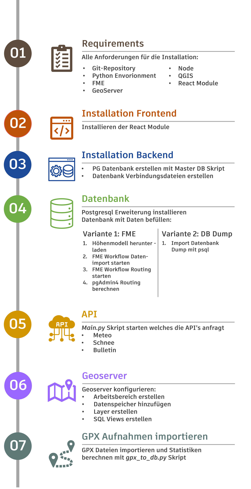
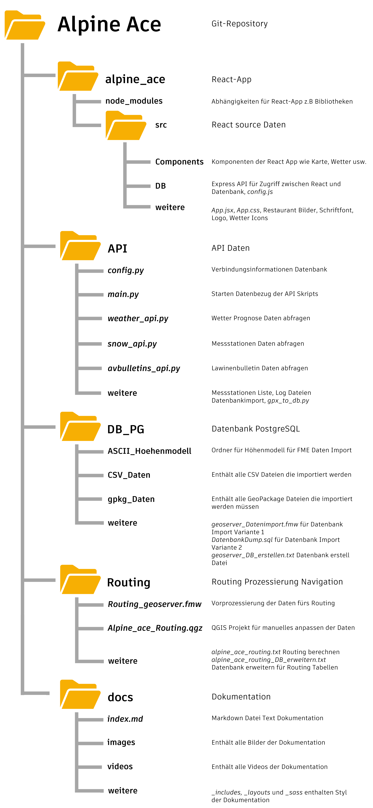

# Alpine_Ace

Die Skigebiets-App zielt darauf ab, eine zentrale Plattform für verschiedene Skigebiete bereitzustellen, die wichtige Funktionen für den Wintersport bietet. Zu diesen Funktionen gehören eine hochwertige Karte für die Orientierung und Navigation im Gelände, aktuelle Wetter- und Lawinensituationen sowie Informationen zu Verpflegungsmöglichkeiten. Darüber hinaus ermöglicht die App die Darstellung von Statistiken für den Benutzer.

Die Dokumentation zum Projekt befindet sich [hier](https://alpineacemanagement.github.io/Alpine_Ace/).

## Funktionen

- Hochwertige Karten zur Orientierung und Navigation im Gelände.
- Aktuelle Informationen über Wetter und Lawinensituation für jedes Skigebiet.
- Informationen zu Verpflegungsmöglichkeiten in den Skigebieten.
- Statistikfunktionen zur Analyse der Aktivitäten des Benutzers.

## Ablauf Installation

<center></center>

## Ordnerstruktur

Hier sind die wichtigsten Ordner und Dateien für die Installation aufgelistet.

<center></center>

## Requirements

### Repository lokal klonen

Mit Git in einem Terminal das GitHub Repository _Alpine_Ace_ in ein lokales Verzeichnis klonen.

1. Speicherort angeben

```python
cd /path/to/workspace
```

2. Repository klonen

```python
git clone https://github.com/AlpineAceManagement/Alpine_Ace.git
```

### Python-Requirements

Folgende Python-Module müssen für das Backend Installiert werden:

- Python 3.8.19
- openmeteo-requests
- psycopg2
- requests
- requests-cache
- retry-requests
- pyproj
- pandas
- shutil

Die Module können über das **requirements.txt** im gewünschten Prompt installiert werden. Folgend den Code für die Erstellung des
Environment mit Anaconda

1. Speicherort für Environment festlegen

```bash
cd path/to/workspace
```

2. Python Environment erstellen

```bash
conda create -n my_env python=3.8.19 -c conda-forge --file path/to/requirements.txt
```

### FME-Requirements

FME Workbench 2023.1 (Build 23619) oder aktueller. Kann auf der Webseite von [Safe Software heruntergeladen](https://fme.safe.com/downloads/) werden. Die Software ist Lizenzpflichtig.

### QGIS-Requirements

QGIS Desktop 3.32.3-Lima oder aktueller. Kann auf der Webseite von [QGIS heruntergeladen](https://qgis.org/de/site/forusers/download.html) werden. Die Software ist Open-Source.

### Node-Requirements

Die Webapp wurde mit der Node version 18.18.0 getestet.

### GeoServer-Requirements

Voraussetzung für das Projekt ist die installierte GeoSever Version 2.24.2. Hier ist die offizielle [Installationsanleitung](https://docs.geoserver.org/main/en/user/installation/index.html) für die verschieden Betriebssysteme.

## Installation

### Frontend

Um die Webapp zum Laufen zu bringen, müssen folgende Schritte ausgeführt werden:

1. neues Terminal öffnen -> als GitBash
2. Ordner wechseln

```bash
cd alpine_ace
```

3. npm Module installieren

```bash
npm install
```

4. In der Datei `alpine_ace\src\Components\Network\network_config.js` die aktuelle IP Adresse eintragen.

5. React-App starten

```bash
npm start
```

### Backend

Das Backend besteht aus vier Komponenten. Einem Datenbezugsteil (Python), einer Datenbank (Postgres inkl. Postgis), einem Node-Sever und einem GeoServer der die Geodaten zur Verfügung stellt.

#### Postgres inkl. Postgis

Das Schema der DB findet sich unter _DB_PG/geoserver_DB_erstellen.txt._ Schema in pgAdmin kopieren und ausführen.

#### Datenbank Verbindungen

Für die Python und Java Script Programme gibt es je ein Datei in der die Verbindungsinformationen gespeichert sind.

Damit die bezogenen Daten per Python Script über die APIs gespeichert werden können, muss das **config_template.py** angepasst und in **config.py** umbenannt werden. Die Datei ist im Ordner `API`. Es müssen folgende Parameter geändert werden:

```py
db_config = {
    'host': 'host', #Hostname der DB
    'port': 'port', #Port der DB
    'database': 'database', #Name der DB
    'user': 'user', #Username für die Verbindung zur DB
    'password': 'password'  #Passwort des Username
}
```

Damit die Daten in der React App mit der Express API von der Datenbank bezogen werden können, muss das **config_template.js** angepasst und in **config.js** umbenannt werden. Die Datei ist im Ordner `alpine_ace\src\DB`. Es müssen folgende Parameter geändert werden:

```js
module.exports = {
  user: "username", // Username für die Verbindung zur DB
  host: "hostname", // Hostname der DB
  database: "databasename", //Name der DB
  password: "password", //Passwort des Username
  port: "portnumber", //Port der DB
};
```

## Datenbank

1. Mit pgAdmin 4 eine neue Datenbank erstellen mit dem Namen: `geoserver`
2. Extension [postgis](https://postgis.net/) und [pgrouting](https://pgrouting.org/) installieren.

```sql
CREATE EXTENSION postgis;
CREATE EXTENSION pgrouting;
```

### Datenbank befüllen Variante 1 mit FME

Download vom Höhenmodell DHM25 der Swisstopo. Wird für den Datenimport in der FME Workbench verwendet.

1. Zurück ins Basisverzeichnis navigieren:

```bash
cd $(git rev-parse --show-toplevel)
```

2. Daten download starten:

```bash
python DB_PG/ASCII_Hoehenmodell_download.py
```

3. Verzeichnis `DB_PG` öffnen. In diesem sind alle Dateien für den Datenbank Import gespeichert. Jedes Datenformat hat einen eigenen Unterordner.
4. Öffnen der FME Workbench `geoserver_Datenimport.fmw`. Es werden alle Daten aus den verschieden Ordner und Datenformate in die Datenbank geschrieben. Dabei werden die Attribute und Geometrien so extrahiert und verändert, dass diese dem Datenbankschema entsprechen. Vor dem Start der FME Workbench muss unter `Tools ->  FME Options -> Database Connections` die Verbindungsinformationen zur Datenbank eintragen werden. Vor dem Ausführen muss überprüft werden, das der Reader Pfad auf die Daten zeigen.

- `DB_PG\geoserver_DB_erstellen.txt`: Datenbankschema für den Reader `DB_erstellen_script`. Das [Datenbankschema](https://alpineacemanagement.github.io/Alpine_Ace/#datenbankschema) ist in der Dokumentation näher beschrieben

GeoPackage Daten:

- `DB_PG\gpkg_Daten\Pisten_OSM.gpkg`: Daten für den Reader `Pisten_OSM`
- `DB_PG\gpkg_Daten\Pisten_OSM.gpkg`: Daten für den Reader `Skigebiete_OSM`
- `DB_PG\gpkg_Daten\Anlagen.gpkg`: Daten für den Reader `Anlagen`

Höhenmodell DHM 25:

- `DB_PG\ASCII_Hoehenmodell\dhm25_grid_raster.asc`: Daten für den Reader `DHM25`

CSV Dateien:

- `DB_PG\CSV_Daten\Restaurants_Arosa_Lenzerheide.csv` : Daten für den Reader `Restaurants_Arosa_Lenzerheide`
- `DB_PG\CSV_Daten\Parkplatz.csv` : Daten für den Reader `Parkplatz`
- `DB_PG\CSV_Daten\OeV.csv` : Daten für den Reader `OeV`
- `DB_PG\CSV_Daten\meteo_stationen.csv` : Daten für den Reader `meteo_stationen`

5. Jetzt kann die Workbench ausgeführt werden, unter dem grünen Play-Button oben links. Die Userparameter sind in der Dokumentation näher beschrieben im Kapitel [Pisten](https://alpineacemanagement.github.io/Alpine_Ace/#pisten) und [Anlagen](https://alpineacemanagement.github.io/Alpine_Ace/#anlagen). Das ändern der Standartwerte ist nur Fortgeschritten Nutzern empfohlen.

Der Datenimport für alle Daten, ausser das Routing ist jetzt abgeschlossen.

6. Verzeichnis `Routing` öffnen. Hier sind alle Dateien für die Prozessierung des Routings.
7. Öffnen der FME Workbench `Routing_geoserver.fmw`. Vor dem Ausführen muss überprüft werden, das der Reader Pfad auf die Daten zeigen.

- `Routing\alpine_ace_routing_DB_erweitern.txt`: Datenbankschema für die Routing Erweiterung für den Reader `DB_erweitern_Routing`
- Daten von Reader `geoserver_daten` von der Datenbank

8. Jetzt kann die Workbench ausgeführt werden, unter dem grünen Play-Button oben links. Die Userparameter sind in der Dokumentation näher beschrieben im Kapitel [Aufbereitung der Daten](https://alpineacemanagement.github.io/Alpine_Ace/#aufbereitung-der-daten). Das ändern der Standartwerte ist nur Fortgeschritten Nutzern empfohlen.

9. Wenn nötig, anpassen der aufbereiteten Routing Daten im QGIS, [siehe Dokumentation](https://alpineacemanagement.github.io/Alpine_Ace/#manuelle-%C3%A4nderungen-des-routings).
10. Routing Script in PG Admin 4 kopieren und ausführen:`Routing\alpine_ace_routing.txt`

### Datenbank befüllen Variante 2 mit Datenbank Dump

1. Zu Datenbank Dump navigieren in Ordner `DB_PG`.

```bash
cd DB_PG
```

2. Datenbank Dump importieren mit SQL. Username und Passwort der Datenbank einsetzten. Die Datei `DatenbankDump.sql` erhält alle Daten sowie das Datenbankschema. Das Routing ist bereits berechnet.

```C#
psql --host "#hostname" --port "5432" --username "#username" --dbname "geoserver" --file "DatenbankDump.sql"
```

## Datenbank befüllen mit API Daten

Um die Datenbank mit den API Daten zu befüllen, muss das **main.py** in _Backend/API_ ausgeführt werden.

1. Neues Terminal öffnen -> als Command Prompt
2. Ordner wechseln

```bash
cd API
```

3. main.py ausführen

```bash
python main.py
```

#### Node-Server

1. neues Terminal öffnen -> als GitBash
2. Verbindungsaufbau zum Node Server

```bash
cd alpine_ace/src/DB
```

3. Node Server starten

```bash
node connect_db.js
```

### GeoServer

GeoServer Basis Installation gemäss Folien.

#### GeoServer Konfigurationsdatei ersetzten

1. In der GeoServer Installation in den Ordner `webapps\geoserver\WEB-INF` navigieren.

2. Kopiere die Datei `docs\web.xml` aus dem Repository und ersetze die entsprechende Datei in der GeoServer Installation.

3. GeoServer neu starten mit der Start Datei unter: `bin\startup`

#### Arbeitsbereich erstellen

1. Arbeitsbereiche
2. Arbeitsbereich hinzufügen
3. Name

```
Alpine_Ace
```

3. Namensraum URI

```
http://geoserver.org/Alpine_Ace
```

4.  - [x] Standardarbeitsbereich
5.  Security
6.  - [x] Erlaube Zugriff auf jede Rolle
7.  Speichern

#### Datenspeicher hinzufügen

1. Datenspeicher
2. Datenspeicher hinzufügen
3. PostGIS
4. Arbeitsbereich `Alpine_Ace` auswählen
5. Name der Datenquelle

```
geoserver
```

6. host

```
localhost
```

7. port: `Portnummer`
8. database

```
geoserver
```

9. user

```
postgres
```

10. passwd: `Passwort`
11. Speichern
12. Datenspeicher
13. Datenspeicher hinzufügen
14. Vektordatenquelle `GeoPackage`
15. Arbeitsbereich `Alpine_Ace` auswählen
16. Name der Datenquelle

```
swissBOUNDARIES3D
```

17. Verbindungsparameter, database `Durchsuchen`
    Dateipfad: `DB_PG\gpkg_Daten\swissBOUNDARIES3D_1_5_LV95_LN02.gpkg`
18. Speichern

#### Layers

Folgende Layers müssen erstellt werden:

##### Restaurants:

1. Neuer Layer
2. Arbeitsbereich: `Alpine_Ace:geoserver` anwählen
3. Unter Layer mit Namensraum und Präfix , Zeile `restaurant` auswählen und `Publizieren`
4. Koordinatenreferenzsystem:
   Suche nach `EPSG:2056`
5. Begrenzendes Rechteck:
   Aus den Grenzen des Koordinatenreferenzsystems berechnen, anklicken
6. Aus den nativen Grenzen berechnen, anklicken
7. Speichern

##### Anlagen:

1. Neuer Layer
2. Arbeitsbereich: `Alpine_Ace:geoserver` anwählen
3. Unter Layer mit Namensraum und Präfix , Zeile `anlagen` auswählen und `Publizieren`
4. Koordinatenreferenzsystem:
   Suche nach `EPSG:2056`
5. Begrenzendes Rechteck:
   Aus den Grenzen des Koordinatenreferenzsystems berechnen, anklicken
6. Aus den nativen Grenzen berechnen, anklicken
7. Speichern

##### Lawinen Bulletins:

1. Neuer Layer
2. Arbeitsbereich: `Alpine_Ace:geoserver` anwählen
3. Unter Layer mit Namensraum und Präfix , Zeile `bulletins` auswählen und `Publizieren`
4. Koordinatenreferenzsystem:
   Suche nach `EPSG:2056`
5. Begrenzendes Rechteck:
   Aus den Grenzen des Koordinatenreferenzsystems berechnen, anklicken
6. Aus den nativen Grenzen berechnen, anklicken
7. Speichern

##### Parkplätze:

1. Neuer Layer
2. Arbeitsbereich: `Alpine_Ace:geoserver` anwählen
3. Unter Layer mit Namensraum und Präfix , Zeile `oev` auswählen und `Publizieren`
4. Koordinatenreferenzsystem:
   Suche nach `EPSG:2056`
5. Begrenzendes Rechteck:
   Aus den Grenzen des Koordinatenreferenzsystems berechnen, anklicken
6. Aus den nativen Grenzen berechnen, anklicken
7. Speichern

##### ÖV Haltestellen:

1. Neuer Layer
2. Arbeitsbereich: `Alpine_Ace:geoserver` anwählen
3. Unter Layer mit Namensraum und Präfix , Zeile `parkplatz` auswählen und `Publizieren`
4. Koordinatenreferenzsystem:
   Suche nach `EPSG:2056`
5. Begrenzendes Rechteck:
   Aus den Grenzen des Koordinatenreferenzsystems berechnen, anklicken
6. Aus den nativen Grenzen berechnen, anklicken
7. Speichern

##### Pisten:

1. Neuer Layer
2. Arbeitsbereich: `Alpine_Ace:geoserver` anwählen
3. Unter Layer mit Namensraum und Präfix , Zeile `pisten` auswählen und `Publizieren`
4. Koordinatenreferenzsystem:
   Suche nach `EPSG:2056`
5. Begrenzendes Rechteck:
   Aus den Grenzen des Koordinatenreferenzsystems berechnen, anklicken
6. Aus den nativen Grenzen berechnen, anklicken
7. Speichern

##### tlm_kantonsgebiet :

1. Layer hinzufügen
2. Arbeitsbereich `Alpine_Ace:swissBOUNDARIES3D` auswählen
3. Unter Layer mit Namensraum und Präfix , Zeile `tlm_kantonsgebiet` auswählen und `Publizieren`
4. Koordinatenreferenzsystem:
   Suche nach `EPSG:2056`
5. Begrenzendes Rechteck:
   Aus den Grenzen des Koordinatenreferenzsystems berechnen, anklicken
6. Aus den nativen Grenzen berechnen, anklicken
7. Speichern

##### tlm_landesgebiet :

1. Layer hinzufügen
2. Arbeitsbereich `Alpine_Ace:swissBOUNDARIES3D` auswählen
3. Unter Layer mit Namensraum und Präfix , Zeile `tlm_landesgebiet` auswählen und `Publizieren`
4. Koordinatenreferenzsystem:
   Suche nach `EPSG:2056`
5. Begrenzendes Rechteck:
   Aus den Grenzen des Koordinatenreferenzsystems berechnen, anklicken
6. Aus den nativen Grenzen berechnen, anklicken
7. Speichern

#### SQL views

Folgende SQL views müssen erstellt werden:

##### Routing: Nächster Konten finden:

1. Neuer Layer
2. Arbeitsbereich: `Alpine_Ace:geoserver` anwählen
3. SQL View konfigurieren
4. Name der View:

```
a_a_nearest_vertex
```

5. SQL-Statement:

```sql
   SELECT
    v.id,
    v.the_geom
FROM
    a_a_routing_noded_vertices_pgr AS v,
    a_a_routing_noded AS e
WHERE
    v.id = (
        SELECT
            id
        FROM
            a_a_routing_noded_vertices_pgr
        ORDER BY
            the_geom <-> ST_SetSRID(ST_MakePoint(%x%, %y%), 2056)
        LIMIT 1
    )
    AND (e.source = v.id OR e.target = v.id)
GROUP BY
    v.id, v.the_geom
```

6. `Schlage Parameter vor`
7. Standardwert für x

```
2600000
```

Reguläre Ausdruck-Validierung

```js
^[\d\.\+]+$
```

8. Standardwert für y

```
1200000
```

Reguläre Ausdruck-Validierung

```js
^[\d\.\+]+$
```

9. Attribute: Aktualisieren
10. the_geo: `Point` auswählen als Typ
11. Speichern
12. Koordinatenreferenzsystem:
    Suche nach `EPSG:2056`
13. Begrenzendes Rechteck:
    Aus den Grenzen des Koordinatenreferenzsystems berechnen, anklicken
14. Aus den nativen Grenzen berechnen, anklicken
15. Speichern

##### Routing: Kürzester Weg finden:

1. Neuer Layer
2. Arbeitsbereich: `Alpine_Ace:geoserver` anwählen
3. SQL View konfigurieren
4. Name der View:

```
a_a_shortest_path_test
```

5. SQL-Statement:

```sql
SELECT
    min(r.seq) AS seq,
    e.old_id AS id,
    e.p_farbe,
    sum(e.distance) AS distance,
    ST_Collect(e.the_geom) AS geom,
    sum(e.cost) AS cost,  -- Adding the 'cost' column
    sum(e.rcost) AS rcost  -- Adding the 'rcost' column
FROM
    pgr_dijkstra(
        'SELECT id,source,target,distance AS cost, rcost FROM a_a_routing_noded', %source%, %target%, false
    ) AS r,
    a_a_routing_noded AS e
WHERE
    r.edge = e.id
GROUP BY
    e.old_id, e.p_farbe
```

6. `Schlage Parameter vor`
7. Standardwert für source

```
0
```

Reguläre Ausdruck-Validierung

```js
\d+
```

8. Standartwert für target

```
0
```

Reguläre Ausdruck-Validierung

```js
\d+
```

9. Attribute: Aktualisieren
10. the_geo: `MultiLineString` auswählen als Typ
11. Speichern
12. Koordinatenreferenzsystem:
    Suche nach `EPSG:2056`
13. Begrenzendes Rechteck:
    Aus den Grenzen des Koordinatenreferenzsystems berechnen, anklicken
14. Aus den nativen Grenzen berechnen, anklicken
15. Speichern

##### Restaurant: Angewähltes Restaurant anzeigen:

1. Neuer Layer
2. Arbeitsbereich: `Alpine_Ace:geoserver` anwählen
3. SQL View konfigurieren
4. Name der View:

```
a_a_restaurant
```

5. SQL-Statement:

```sql
  SELECT
    v.Restaurant_ID,
   v.R_Name,
   v.R_Oeffnungszeiten,
   v.R_Telefon,
   v.R_Email,
   v.R_Webseite,
   v.R_Geometry
   FROM
    Restaurant AS v
   WHERE
    v.Restaurant_ID= %Restaurant_ID%
```

6. `Schlage Parameter vor`
7. Standardwert für Restaurant_ID

```
0
```

Reguläre Ausdruck-Validierung

```js
\d+
```

8. Attribute: Aktualisieren
9. the_geo: `Point` auswählen als Typ
10. Speichern
11. Koordinatenreferenzsystem:
    Suche nach `EPSG:2056`
12. Begrenzendes Rechteck:
    Aus den Grenzen des Koordinatenreferenzsystems berechnen, anklicken
13. Aus den nativen Grenzen berechnen, anklicken
14. Speichern

##### StatistikenViewer: Angewählte Strecke anzeigen:

1. Neuer Layer
2. Arbeitsbereich: `Alpine_Ace:geoserver` anwählen
3. SQL View konfigurieren
4. Name der View:

```
a_a_skidaten_weg
```

5. SQL-Statement:

```sql
SELECT
    v.Skidaten_ID,
    v.SD_Date,
    v.SD_Hoehenmeter,
    v.SD_Distanz,
    v.SD_Dauer,
    v.SD_Geschwindigkeit,
    v.SD_MaxGeschwindigkeit,
    v.SD_Saison,
    v.Benutzername,
    v.SD_Geometrie
FROM
    Skidaten AS v
WHERE
    v.Skidaten_ID = %Skidaten_ID%
```

6. `Schlage Parameter vor`
7. Standartwert für Skidaten_ID

```
0
```

Reguläre Ausdruck-Validierung

```js
\d+
```

8. Attribute: Aktualisieren
9. the_geo: `LineString` auswählen als Typ
10. Speichern
11. Koordinatenreferenzsystem:
    Suche nach `EPSG:2056`
12. Begrenzendes Rechteck:
    Aus den Grenzen des Koordinatenreferenzsystems berechnen, anklicken
13. Aus den nativen Grenzen berechnen, anklicken
14. Speichern

### GPX-Daten laden

Momentan müssen die GPX-Dateien noch manuell in die Datenbank eingelesen werden. Dazu muss das File **gpx_to_db.py** im Ordner _API_ ausgeführt werden. Im File muss dabei der Pfad zur GPX-Datei angegeben werden:

```py
# GPX-Datei hochladen
path = "path/to/gpx"
```

Es empfiehlt sich, innerhalb des Projekts einen Ordner namens "GPX" anzulegen und dort die Dateien zu speichern.

## Page

Für weiter Informationen zum Projekt besuche unsere GitHub Page:
[alpineacemanagement.github.io](https://alpineacemanagement.github.io/Alpine_Ace/)

### API

Es werden drei APIs verwendet. Die Dokumentationen dazu sind unter folgenden Links ersichtlich:

- [Open-Meteo](https://open-meteo.com/en/docs)
- [SLF Measurement API](https://measurement-api.slf.ch/)
- [SLF Lawinenbulletin api](https://aws.slf.ch/api/bulletin/caaml)

## Mitwirkende

- [Andrea Bricalli](https://github.com/AJPB4133)
- [Fabian Gross](https://github.com/loopercamera)
- [Théo Reibel](https://github.com/TheoR14)

## Lizenz
