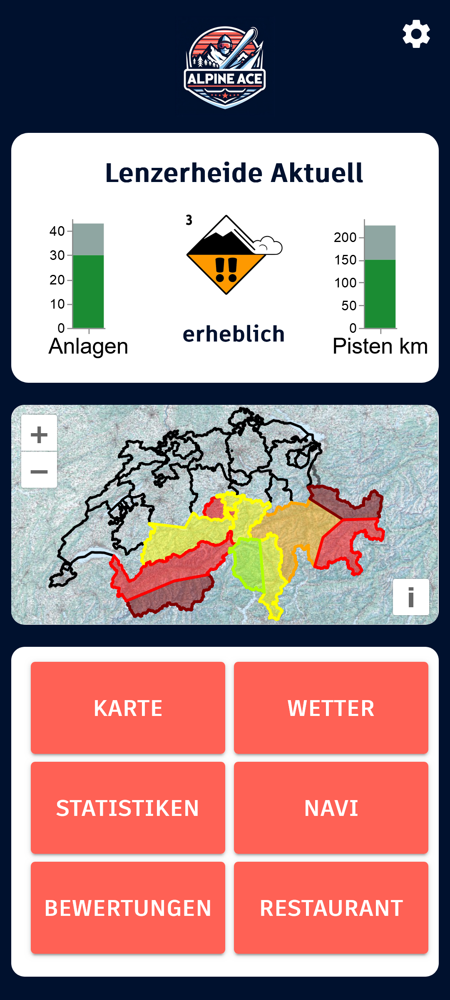

# Alpine Ace - Ski App

Das ist die Projekt Website des *Alpine Ace Ski App*. Das App enthält eine Server und eine Client Umgebung.
- Server: FastAPI
- Client: React + OpenLayers

GitHub Repository: [AlpineAceManagement/Alpine_Ace](https://github.com/AlpineAceManagement/Alpine_Ace)

## Inhaltsverzeichnis
- [Beschrieb](#beschrieb)
- [Architektur](#architektur)
    - [Backend](#backend)
    - [Frontend](#frontend)
- [Funktionen](#funktionen)
- [Incoming Features](#features)
- [Contribution](#contribution)

## Beschrieb des Apps

Ziel dieser App ist eine zentrale Plattform für verschiedene Skigebiete zu erstellen, welche wichtige Funktionen für den Wintersport zu Verfügung stellt. Dies umfasst eine hochwertige Karte für die Orientierung und Navigation im Gelände, das aktuelle Wetter und Lawinensituatuion sowie Informationen zu Verpflegungsmöglichkeiten. Diese App ermöglicht Statistiken für den Benutzen darzustellen.

## Architektur

### Backend

#### API
Um dem User die aktuellsten Informationen über das Skigebiet zur Verfügung stellen zu kön- nen, werden einige APIs benötigt.

- Meteo: Die Wetter Daten werden über [https://www.meteomatics.com/de/free-wetter-api/](https://www.meteomatics.com/de/free-wetter-api/) bezogen. 500 Abfragen pro Tag sind kostenlos. Die Abfrage der Daten erfolgt im Viertelstunden Takt.

- Lawineninformation: Lawineninformation werden über die API des Institut für Schnee und Lawinenforschung (SLF) bezogen [https://www.slf.ch/de/services-und-produkte/slf-datenservice/](https://www.slf.ch/de/services-und-produkte/slf-datenservice/). Dabei kommen die Daten von den Interkantonalen Mess- und Informationssystem (IMIS) bezogen. Der Bezug der Daten ist kostenlos. Die Abfrage der Daten erfolgt im 24h Takt.

- Schneehöhen: Die Schneehöhen werden über die API des SLF bezogen. Dabei handelt es sich um die Gleiche API wie bei den Lawineninformation. Die Abfrage der Daten erfolgt im 24h Takt

- Informationen über Skigebiet: Die Informationen zu den offenen Anlagen oder den offenen Pisten werden entweder über Scraping oder über eine API der einzelne Bergbah- nen bezogen, dies ist jedoch noch in Abklärung.

#### Datenbanken
In diesem Projekt werden neben herkömmlichen Daten auch räumliche Daten wie Pisten und Anlagen als Geometrien gespeichert. Um sicherzustellen, dass die Datenbank die geometrischen Daten effizient verarbeiten kann, wurde entschieden, die relationalen Datenbank PostgreSQL in Verbindung mit der räumlichen Erweiterung PostGIS zu verwenden. Dadurch wird PostgreSQL in der Lage sein, räumliche Abfragen und Operationen durchzuführen, was für unser Projekt von entscheidender Bedeutung ist. Darüber hinaus erleichtert es die Integration der Datenbank in ein Geoinformationssystem (GIS), da PostgreSQL mit PostGIS nahtlos mit anderen GIS-Systemen zusammenarbeiten kann.
Durch die Verwendung der räumlichen Datenbank (RDB) ist sichergestellt, dass die Applika- tion in der Lage ist, räumliche Daten ohne grössere Probleme zu verarbeiten und somit eine robuste Lösung für unsere Anforderungen zu bieten.

### Frontend

Da das Ziel ist eine APP für Mobiltelefone zu entfernen musste ein Performance starkes Fra- mework gewählt werden. Dabei kamen drei Frameworks in Frage, wie React Nativ, Flutter oder Progressive Web App (PWA).
Der Entscheid fiel auf PWAs, da die sie Webbasiert sind und somit keine Installation notwendig ist. Trotzdem ist ein App-like Design gegeben. Zudem funktionieren PWAs auf allen gängigen Plattformen und Betriebssystemen. Einschliesslich iOs, Andoird, Windows und macOS. Ein weiterer Vorteil ist, dass PWAs über ein offline Modus verfügen. Heisst sie können auch offline verwendet werden. Weiter können PWAs schneller gestartet werden als native Apps, da sie im Browser bereits zwischen gespeichert sind.

## Funktionen

#### Hauptmenü
Das Hauptmenü ist der wichtigste Ort der Webseite. Aus diesem wird in die Untermenüs navigiert. Die Untermenüs sind in sechs Kacheln angeordnet. Die wichtigsten Informationen zum Skigebiet wie die Lawinensituation, offene Anlagen und Pisten sind wie in einem Dashboard direkt über den Kacheln angeordnet.

#### Karte
In der Karte finden sich verschiedene Funktionen wieder. Beim Start der Karte befindet sich der Kartenausschnitt zentrisch über der Position des Nutzers. Der Ausschnitt kann danach beliebig verschoben, vergrössert oder verkleinert werden. In der Karte sind folgende Informationen dargestellt:

- Pisten Die Pisten werden in der jeweiligen Farbe des Schwierigkeitsgrades visualisiert. Beim Anwählen der Piste wird die jeweilige Pistennummer unterhalb der Karte eingeblendet. Geschlossene Pisten sind zu 50% transparent dargestellt.

- Anlagen Die Sesselbahnen, Seilbahnen und Skilifte sind schwarz als Line dargestellt. Beim Anwählen wird der Name eingeblendet.

- Restaurants und Bars Die Verpflegungsmöglichkeiten im Skigebiet sind mit jeweiligem Piktogramm visualisiert. Nach dem Anwählen erscheinen Informationen zur Örtlichkeit, sowie die Öffnungszeiten.

- POI’sWeiterePointsofinterests,wiezumBeispielParkplätzeoderBushaltestellenkönnen Informationen wie den Namen enthalten.

- Hintergrundkarte Im Hintergrund ist die Winterlandeskarte der Swisstopo (Bundesamt für Landestopografie swisstopo, 2024a.)

#### Wetter
Im Wetter-Menü sind alle relevanten Informationen zu den Bedingungen im Skigebiet. Dazu gehören die aktuelle Temperatur, Bewölkungsgrad, Schneehöhe, Neuschnee, Windgeschwindigkeit und Windrichtung. Letztere wird durch einen Pfeil signalisiert der sich in entsprechende Richtung dreht.

#### Statistiken
Das Menü Statistiken zeigt die Informationen zu den gefahren Pistenkilometern. Die Informationen stammen vom Live-Tracking. Das Menü ist aufgeteilt in die verscheide Tagesstatistiken und den Saisonverlauf. Für jeden Tag wird die zurückgelegte Distanz angezeigt, sowie Höhenmeter, Dauer des Wintersporttages und die Anzahl benutzten Anlagen. Der Saisonverlauf zeigt die über die gesamte Saison zurückgelegte Distanz sowie weitere Informationen und den Tagesdurchschnitt. Für jeden Tag wird der zurückgelegte Weg in der Karte dargestellt. Dieser erscheint nach anklicken der jeweiligen Tagesstatistiken. Unterhalb der Karte sind zwei Liniendiagramme welche die Geschwindigkeit und die Höhenmeter, in Abhängigkeit der Zeit abbilden. Zum Einen kann der ganze Tag abgespielt werden in der Karte und im Diagramm, zum Andern kann im Diagramm ein Zeitpunkt ausgewählt werden. Der Marker springt dann zur Position in der Karte zum entsprechendem Zeitpunkt. So kann der Wintersporttag analysiert werden.

#### Navi
Bei der Navigation wird ein Ziel aus einer Liste ausgewählt. Der Weg zum Ziel wird danach hervorgehoben. Unterhalb der Karte ist eine chronologische Auflistung der Pisten und Anla- gen welche auf der Route genutzt wird. Die Ziele in der Liste haben jeweils zusätzlich zum Namen ein Piktogramm, welches einfach erkennen lässt, ob es sich um eine Anlage, Parkplatz oder ein Restaurant handelt.

#### Restaurant
Die Restaurants des Skigebietes werden in Kacheln angeordnet. In diesen Kacheln ist jeweils ein Bild des Restaurants und darunter der Name. Nach dem Anklicken einer Kachel wird das gewählte Restaurant in der Karte dargestellt. Unterhalb sind Informationen zu Öffnungszeiten und Kontaktinformationen wie Telefonnummer oder Webseite.

## Incoming Features

## Contribution

- Andrea Bricali, GitHub: [AJPB4133](https://github.com/AJPB4133)
- Fabian Gross, GitHub: [loopercamera](https://github.com/loopercamera)
- Théo Reibel, GitHub: [TheoR14](https://github.com/TheoR14)

[Zurück nach oben](#start)