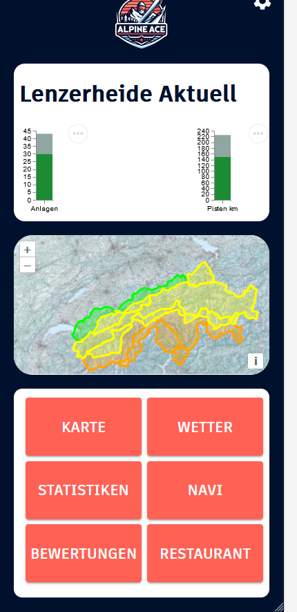

# Alpine Ace - Ski App

Das ist die Projekt Website des *Alpine Ace Ski App*. Das App enthält eine Server und eine Client Umgebung.
- Server: FastAPI
- Client: React + OpenLayers

GitHub Repository: [AlpineAceManagement/Alpine_Ace](https://github.com/AlpineAceManagement/Alpine_Ace)

## Inhaltsverzeichnis
- [Startseite](./index)
- [Beschrieb](./beschrieb)
- [Benötigte Module + Installation](./installation)
- [Contribution](./contribution)
- [Licences](./licences)
- [Datenbankschema](./datenbankschema)
- [Prozess Diagramm](./prozess)
- [Funktionen](./funktionen)
- [Incoming Features](./features)