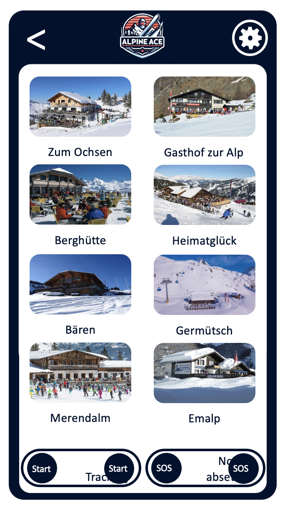

<a id=start></a>

# Alpine Ace - Ski App

Das ist die Projekt Website des _Alpine Ace Ski App_. Das App enthält eine Server und eine Client Umgebung.

- Server: Node Server
- Client: React + OpenLayers

GitHub Repository: [AlpineAceManagement/Alpine_Ace](https://github.com/AlpineAceManagement/Alpine_Ace)

<center></center>

## Inhaltsverzeichnis

- [Alpine Ace - Ski App](#alpine-ace---ski-app)
  - [Inhaltsverzeichnis](#inhaltsverzeichnis)
  - [Beschrieb des Apps](#beschrieb-des-apps)
  - [Architektur](#architektur)
    - [Backend](#backend)
      - [API](#api)
      - [Datenbank](#datenbank)
        - [Datenbankverbindung](#datenbankverbindung)
        - [Datenbankschema](#datenbankschema)
      - [Datenimport mit FME](#datenimport-mit-fme)
      - [Node Server](#node-server)
        - [Fehler](#fehler)
    - [Frontend](#frontend)
      - [Mock-Up](#mockup)
      - [Farbschema](#farbschema)
  - [Funktionen](#funktionen)
    - [Kopfzeile](#kopfzeile)
      - [Funktion](#funktion)
    - [Hauptmenü](#hauptmenü)
      - [Bulletin Karte Lawinen](#bulletin-karte-lawinen)
      - [Bulletin Karte Grenzen](#bulletin-karte-grenzen)
      - [Funktion](#funktion-1)
    - [Karte](#karte)
      - [Skigebiete](#skigebiete)
      - [Pisten](#pisten)
      - [Anlagen](#anlagen)
      - [Parkplätze](#parkplätze)
      - [ÖV-Haltestellen](#öv-haltestellen)
      - [Funktion](#funktion-2)
    - [Wetter](#wetter)
    - [Statistiken](#statistiken)
      - [Konzept](#konzept)
      - [Funktion](#funktion-3)
    - [Navi](#navi)
      - [Konzept](#konzept-1)
      - [Aufbereitung der Daten](#aufbereitung-der-daten)
      - [Manuelle Änderungen des Routings](#manuelle-änderungen-des-routings)
      - [Berechnen des Routings](#berechnen-des-routings)
      - [SQL views Routing](#sql-views-routing)
      - [Funktion](#funktion-4)
    - [Restaurant](#restaurant)
      - [Funktion](#funktion-5)
  - [Incoming Features](#incoming-features)
    - [Karte](#karte-1)
  - [Contribution](#contribution)

## Beschrieb des Apps

<a id=beschrieb></a>

Ziel dieser App ist eine zentrale Plattform für verschiedene Skigebiete zu erstellen, welche wichtige Funktionen für den Wintersport zu Verfügung stellt. Dies umfasst eine hochwertige Karte für die Orientierung und Navigation im Gelände, das aktuelle Wetter und Lawinensituation sowie Informationen zu Verpflegungsmöglichkeiten. Diese App ermöglicht Statistiken für den Benutzer darzustellen.

## Architektur

<a id=architektur></a>

### Backend

<a id=backend></a>

#### API

Um dem User die aktuellsten Informationen über das Skigebiet zur Verfügung stellen zu können, werden einige APIs benötigt.

- Meteo: Die Wetter Daten werden über [https://open-meteo.com/](https://open-meteo.com/) bezogen. Abfragen für nicht kommerzielle Nutzungen sind Kostenlos. Insgesamt sind pro Tag 10'000 Abfragen möglich. Die Abfrage der aktuellen Wettersituation erfolgt im Viertelstunden Takt, die der Wettervorhersage erfolgt alle 24 Stunden.

- Lawinensituation: Lawineninformationen werden über die API des Institut für Schnee und Lawinenforschung (SLF) bezogen. Der Bezug der Daten ist kostenlos. Die Abfrage der Daten erfolgt im 12 Stunden Takt.

- Schneehöhen: Die Schneehöhen werden über [https://measurement-api.slf.ch/](https://measurement-api.slf.ch/) bezogen. Es handelt sich um eine API des Institut für Schnee- und Lawinenforschung. Die Daten werden vom Interkantonalen Mess- und Informationssystem (IMIS) bezogen. Die Nutzung ist Kostenlos. Die Abfrage der Daten erfolgt alle 30 min.

- Informationen über Skigebiet: Die Informationen der Skigebiete werden in Zukunft über ein Webscraping der Seite Bergfex gemacht.

Damit der Datenbezug reibungslos läuft, werden die Scripts für den Datenbezug über eine Datei **main.py** gesteuert. Diese Datei läuft im Hintergrund und ruft die einzelnen Scripts in den oben erwähnten Zeitintervallen auf um sie auszuführen.

#### Datenbank

<a id=datenbank></a>

In diesem Projekt werden neben Sachdaten auch Daten mit Raumbezug verwendet, wie Pisten und Anlagen welche Geometrien haben, verwendet. Um sicherzustellen, dass die Datenbank die geometrischen Daten effizient verarbeiten kann, wurde entschieden, eine relationale Datenbank mit der räumlichen Erweiterung PostGIS zu verwenden. Dadurch wird PostgreSQL in der Lage sein, räumliche Abfragen und Operationen durchzuführen, was für unser Projekt von entscheidender Bedeutung ist.

##### Datenbankverbindung

<a id=datenbankverbindung></a>

Während des Betriebes der Plattform müssen verschiedene Systeme Lese- oder Schreibzugriff haben. Für die Datenbankverbindung werden folgende Informationen verwendet:

- **Benutzername:** postgress
- **Passwort:** gesetztes Passwort der Datenbank
- **datenbankname:** geoserver
- **host:** Während der Entwicklung wird Local host verwendet
- **port:** Standardmässig wird der Port 5432 verwendet

Die Informationen werden an verschiedenen Orten im Programm Code verwendet. Dafür wurde für Python und JS jeweils ein Config File erstellt, in welchem die Verbindungsinformationen angegeben sind:

- **Python:** `API\config.py`

- **JS:** `alpine_ace\src\DB\config.js`

- **FME:** Bei FME muss unter ` Tools ->  FME Options -> Database Connections` die Datenbankverbindung zum GeoServer angepasst werden.

##### Datenbankschema

Das Datenbankschema ist in folgende Gruppen eingeteilt:

- **Skigebiet:** Das Skigebiet ist mit sehr vielen Tabellen verknüpft.
- **Meteodaten:** Beinhaltet Informationen Wetterprognose, Schneehöhen, Messdaten
- **Sicherheitsinformationen:** Verfügt über das aktuelle Lawinenbulletin
- **Pistenplan (Punktinformationen):** Standorte von POI wie Restaurants, Parkplätze und ÖV-Haltestellen
- **Pistenplan (Linieninformationen):** Anlagen und Pisten sowie deren Start und Endpunkte
- **Routing:** Enthält Tabellen für das Erstellen des Routings (inaktiv) und die eigentlichen Routing Tabellen (aktiv)

<iframe frameborder="0" style="width:100%;height:2000x;" src="https://viewer.diagrams.net/?tags=%7B%7D&highlight=0000ff&edit=_blank&layers=1&nav=1&title=Alpine_Ace_Datenbank_UML.drawio#R7Z1td%2BI4ssc%2FTc7pedE5fsZ%2BmQfS3femk2yS2enZNxwHFPDGwbngdKfn01%2FJSICRbOyAbYWq2Tk7wRhjrH%2FpJ5VKVUf22fPbl1n4MvmejEh8ZBmjtyP7%2FMiyepZv0%2F%2BwI78XR0zb9RZHxrNoxI%2BtDtxF%2FxB%2B0OBHX6MRmedOTJMkTqOX%2FMFhMp2SYZo7Fs5mya%2F8aY9JnP%2FWl3BMpAN3wzCWj%2F4VjdIJP2p6weqNryQaT%2FhX%2B1Zv8cZzKE7mv2Q%2BCUfJr7VDdv%2FIPpslSbr46%2FntjMTs6YnnsvjcRcG7yxubkWla5QN%2FPfzfv%2F7lfLsamlfBf379568%2F497%2FfLZsm7fHzzB%2B5b%2BZ32%2F6WzyEn2SWRvSZXIYPJL5J5lEaJVP61kOSpsnzkX0qTjiJozF7I01e6NFJ%2BhzTFyb9k%2F74F3ax57cxE8rxQziPhscvYZqS2fQiiuPbrPFOH%2Bmfd%2FyL50nM7v10nhJ6tXN3%2BfYseVo2hnFs5Y6fJXEyy%2B7aHmX%2FsHeTaXoRPkcxE%2BFXEv8k7Gb5G1xyJrvLmP2%2B03D4NJ4lr9ORuNaIPIavsbi9tW%2B48M%2F6Z2fZLW58tzf0ycMjfYc%2FXPp8yFthw5lLOVBDIskzSWe%2F6Sn8A59ty%2BcaEla0PPBrpUlHCG2yJkfL5QdDbgfj5eVXUqF%2FcLXUUI5pGYGknLunaEweIpJKEhICSMMHdog%2BsXAmnr1t0APUgNMwmpIZV8wwiePwZR5lpy%2BOTKJ4dBn%2BTl5TcSHxijbMGxndLqydnUsN%2F5JejL00REPzm2Fvh1ynQ9oE7BtPZ2RO7%2BUynKf8jP20m7PRbnZPbjcrULSb2WC7ia61zOJzzXXLuq3TSTKL%2FmGNFPOHut6E2etf0XMcTml3GI42Dp0mGQCMDROaJlMiNTU7aTRLXu7D2Zik%2FMBLEk3T7FG4p%2FRf%2BgvOjGP3yKX3ekZfm6vX9F92%2Biw9S6bULKmk2DUIbdlfhLXuhq1G0wmZRex41mdlXxaTR%2FG9M94k7G%2FR21XXR6nhyLrhKrErasRuUCKmJJGb%2Fy0UCf3JaRRmXXg4HWfmndAn8xhnuJtEoxGZLiycITpcNbNCC7VaZ9kim021ae%2B7tJZpqFtrrXnsmq3DL7Z6YLWvFsYMnGFKLYuCai41%2BfI%2Bd1KBVdzBD77Rl8a3q%2Fv%2Bl%2F7t0XKM06w4RLe9kMCetDJ%2FCYfRdHy5ONXbUI%2FbkHreim3d26uaKl2uHTnZyJ2duGM0yx1PA%2B441SWiH3V26idssJRxZcp8GVyFz%2ByG%2F31ye%2Fb15PaTaRh%2F0JdX1%2Ffs%2F%2F%2B8vDwk3jShG4h8qeDJQL50x5dAA770wPLFA8sXX8WXizgkwwm75y%2F96%2B%2F9%2B9u%2FP33%2F8%2FL%2B28315d9frq%2BY%2BVmGZbjeHwc2uWlCRBBhIzs%2FETYawca0uqeNuAWAtClonMOnjSV7TpEe5aKAR4%2FAciVRkNGYCKcj7XgnyTiZhnF%2FdfQ0W5Mkggqrcy6TrFGZn%2Fu%2FJE1%2Fc5qEr2lylFuEJW9R%2BoN%2FnP39N%2Fv72OWvzt%2FW3joXpKGNOvv9Y%2F3F2qfYy9XHslfic3kBrlZQpZW3zaXjZyr77OdWXrVlr%2BUv2rqWS6ajExYgsLIheoQtRef6P9YshULnh%2BbJ62xIyhrcdnkvkAoeF58aFAyyZiQO0%2Bhn%2Fm72Ti1qJBWm0eyZvhT2BfkO62jJwRpLp45j5JdOHbl3MA2VPTuNAZ0%2BGnlBRHo0GCtRECtxcer25J6Bfbf34Lm7wUWotnTE0bZeTKcnuxvunqIRhcu0fLKwMTH4sAESNRtLjATsvO2rgl18FcqbbErZi1DehDjf22vQBLelOkETao00KBHZJQA1aIKbC8AJ4FJ0ij5%2FETNx17%2F9dnJ5YF7FPYZMFGqneJ7ouHvVUqXLtSOmGt4EpE771FGETLRNHV%2Bek9xBpY5fMKsEQB05tqowVO%2B2f9G%2F7V%2Bd9e8YjcRZn9bP%2FwPZVE9hENlUYy0d2bT%2FFbBtbFKEW7TOphqTZv3ItFM%2FUdA2AEik2BV0Pjin30oPnp%2Fc9w8JLU1IBCBKRFeFKNETJapgirZZEnS0sN49SwKoG5CcQDG3PR98TciETOnVyYy%2Bd3F5fXKPTCmXCkSm4G4jvZniasAUqNuNuHWAZIpiuxGdn0TUzqf%2FIE%2BqyQQiT3B3kd48qRwl0iBPoG4vcoqCFgHwRLG9iPm7XrPZyf237%2F0j3LdaXTAQyYJbibQmyzJhUndkcUU0NECyQN1K5Bqyx5OS5QuZDye%2FoukoGj8R2hY4Y6kkF3hccQ3Ze4pc0Ykrij0trXOlhpf0oLjCrQMkV2SvJ%2BXK9%2FAN0fIuxUBEi%2BxERbTohBZFntnW0VLDYXpgaHHBokWx4fF8cBdG82TKvGH9H0iTLSKBSBPcW6k1TWxDA5rUcJIeGE2gbqV0FYnqMwdYdukol7vt8ttV%2F%2B7%2B9tvVl3zmNlx4qSoneNzxXdnBekqmr%2Bk%2FZPYyS2jzllNogzjAkjQI4yzO0WCpELGcmeyfEb5IsoPjiHeOI3bcf8kNqmQcUU0jzQ0jfFf2d0LN0cDNBeDAwndlD6jo%2BKf5vOOucWj5X%2Fe4G7ZQQSUZ%2FfY7lqh0uXYkhR7RTuew29ijKm7RNnugOkS5cYAkjewQPd2sbeFiaYtaqoFIF%2FSQak0XVWmLtukC1UHKjQMiXcSgJkeXfyfqSQwCpqpwAALGw0RzWgNGWc6iZcJUyX59mITxoOaV8z3ZX3o6%2BJ9wMhvTuz5azyqHeKmqGoh4qbHRHvHSAV4UyRhax0sND%2BqB4cUBixfZJXq62OEUk%2BGERaB%2F6d%2Bdfb3sn329R8bUkA5ExmA%2BUr0ZUzVEpEnGQE1Iyq0DJGNkx%2BjpoP8csvAudJG9UzYA%2BSIC15AvevJFlaahbb70oCYp5dYBkS892S16Orgn9IFne54yvJiIl1qqgYgXzFeqN14U2RpaxwvUfKXcOkDiRXaLng5uwvn8F7UmnMG8WzkAEaNIVSipRK6KvV5AvGaN8g9QBHyXkujmUa2S6ItnXVpQfEtJ7u2FxpcVA7cXGi%2BM3q9caJx%2F9IaNAlYWtdS2qNy9qfXFr%2BCfWulcupAd5C%2FUCzYutPiN0oX2ZjCBIoOWKVsMbdCs2HfeVqprPNu1t9bP5kdV5y1YQWH%2FWqWSe2lnU9jvGse%2B5eaa9zN%2F2O%2BVnzgleXyck6YEIQ%2FS5UreKIj3COIzVYQvUlMJSTi7SUJceuMTzSmEdtWyQq6yjWXqqu%2F0%2BaZqmfAh1Q4iCV%2FTZM61IMGYw10xpquiLct7v7bWN6AZhULb%2BwZlRQCd2VOMzJympm%2F0hiusULKn9rKT%2BZVHHX22lo7sZWihYmHOtRSPZjmSbeLZVJjaClvIOtcbqu00SphNiJmEZCzZvGPduMQc6PltPAtfJscP4TwaHr%2BEKRt9X1BbYGN4bhZCo%2FMkZvdO7YewWYy7fJuZ01%2F8kRnHVu64kP2RZY%2Byf%2Bp02ttNaM1q6TcEJ2e90wvJxOk73tAnD487zaCEbEvsTJaP0658TMdWLPK9xjF9wtO5pCNQWRy2NJ6V7wz83rErtaZtW8e%2B3J5mg%2B0pemH0hh51U%2FjcLsijXJzKoUAlDZbbcOTVNqjJHLjBAHSQOo48SRdd%2F6Ly%2BV3%2F9tvJ5RGmcairnWIXqW3UtvVtaqp0wXYEhStx3aYj3MIeRSqHDtgDdSmOmwdI0qiW4s7pHWelnsRCHJ0P%2FXFIpGlCK1DJgjUEtSaLIo1DB2QBW0TQAVtE0JFX5k8Ht2QcJXwOk4vyQLaUqQUqW7CKoNZsUWVwaB8uwmULEC5Q6wg6qjTX6izq3%2F%2B8vP92c33595frq1wedSROmYRAEseyFBv276IhbSh6Z%2Bk8mj4ms%2BeQLdFi3MN%2B4x7qLemZlmpJz1T0Tk2GPlQIPW089MFeRjos014ofImBquP2GmOyZSmyUUvPBkMf1KEPj4%2BP1nAoWTn7bu%2FBc3fr8YVsSwcNgRUcB%2Bv%2FtCke0xJaWV8DjeaqUDNQUQ%2FlsYYuHXfbuZ5AUS%2FP9nvHPbkxGyxgQb%2Bz%2Bugc53D7j3rg1lQr6kGtkiYtXsYF1KgHbjAAJ3WWJQ%2B%2Bs35%2F4S5cpeVbTONakcfHi3wo1E%2FJjM6tbe9bFFXtgm2IKhBpxhE3WuBGFejQNm4CRV7xO6C4CcBmGg8UmcbvnqIxeYhIuomc2%2F5F%2F7Z%2Fdda%2Foy%2BWZ31aP%2F%2BgXIp7BFKhwmACic6ucULU5aLWNkKpAiZanxDZct%2F0gfi0U%2BtAXdOybEXo%2F2ZdJQzE264UoFyxZa8pckUjriiDJdoHSw137GGBxS5oHgBgUXhXB1evz8%2B5GG8XwbJFKVDBgmVg9QaLotBFB2CBWgmW2wdIsMhh%2FTeDi3D2wG744uT2tI9IKdcIVKRg7Ve9kaJIn9MBUqCWf%2BX2AREpiiQpN4O7NExf6Rcap9fXmAR2i0aAIkWROAWRohFSVKUs2keKIrEKEKQ4UOu9WorcJzcDEk1%2FkTEipZJGoCIFK7zqjRRF%2BYoOkAK1xiu3D5BIkZ2dN%2Brtp5ffrvp397ffrr7kNp9iUYvKaoIKH4VvNdsExWbDs%2FTldfqUltNogzzA9kOZ1rFle75D5x2u5dmmiAMv2Rxle8euSc%2Fs%2BYHTsz3FnuTNag37xAi6RLsNXHcKtiCXZYfdKpgmxx2ydxTsnikHrL9UkfxEuWcqF8C%2BAMknceJBBX7scytVkazKkmPs1CVsE13ti7ejQXS9djtP3oIuZXLZLtHlgvXCFhXkBAAqhRd2bT7zlCSzUTRdFBRaTZ9vrinCMG1TZR0hmfKPSRH5uhBdfzrCKfRuU2hlkEinc2gXI1W7nUO7BT48XefQrsKPC3UO7YINY3ULXK04hz7afQ5dJCscqeQfE7p%2Fu51Db0GXfnNosMGxYDOWWIqMJavpDM6g96Ii5FJecrJv92Qah2NMxlmmniwZp5HNmRftebQ%2BcbYLdlc46ylXHVkAzSUzpu1cwyWL448Gps5egUevPE3nNsk0OABRVIUHO3deWA%2FIIYnsYV3wQU7aeTjjjn3Oj4ukUx72tovdb4%2BBq3v1dhJ5OggkjYBUkMizOyAFCu8%2F3KyeUEOzA4VLH7N67p9bhQpDbm32o%2BjZ7dazuwVkBfk%2Bu5xZgXXtVqhNc5jYWu5HWJ9HYfLP%2BkpB%2FGwKC4NztcZPUVrQDvnTq%2BELPiz%2B9MCG5%2FZkb%2B7J4GtCJlkqt8vrk2y7Km5arSgYxNDmg8JcCnpjqCCJaJcYAptYoQfVe2f1ZO%2FdCaZ%2Fq6MRJM%2Fmg5Kje5E8OpHnndEwTZKnhsv2wMhTsJMUAHlkp2uIWeLqaATJs%2FGgRMeG5NGTPEUpSTskj1%2FDW3tY5FkYC0Ty%2BLK79QSTyTWjJmTU5oNS%2BH0X8f2YZ24fm%2BTfG%2Bvf4C55H12x3UZWLmzuA4X6%2B7InFmyovw%2FWN%2BsrfLPKUP9cWCWnyaflqQcVwrLPnQBFysIxy%2BaDQo9ut%2FPqLQDTbmuA5YN16PpgHbq%2B7NDNzWxwv%2FxehIR02nhQYuam0B0mndt5Pu0a2s2nA4yw7XY%2BHRQ4%2B7SdTweyxxfsfDoAG3IbFLlecT69l%2Fl0kbJwxLL5oNAh3O18egvA9JtPB2BDcwOw7t%2BgyP2L2ef2JyNk08Zs0epJkiGjMRFjBNqtT5JxMg3j%2Fuoond%2FSGyKCOatzLpOsydmQ9b8kTX9zVoWvacJ4lj7H%2FF3yFqU%2F%2BMfZ33%2Bzv49d%2Fur8be2tc8Ex2uSz3z%2FEBdiLtU%2Bxl6uPZa%2FE5%2FLyHJHH8DVOVbNwprRoGMYn%2FI1nahTZz2WDpovwOYrZJb%2BS%2BCdh54nR1OI3miZ%2FLX9RHD6Q%2BDQcPo2z5yafQKajk9ksM0RuYfTIRRQL7i9aiDVLPTOwlrkR5snrbEhKLcbio%2BVUjAKKTy0q2zMjcZhGP%2FN3WWgr9CeHv9dO4COO1ZVv2IGVzTq2cWxbPHujIy4vgpxNd90%2Bdvow%2FWNxb%2Fs2NdlhaiqN75IJJm8w1cWa%2BZLW%2Bu%2F8QO68BTkX9tt5uNBjRmUhW%2BXeUeM4sHlHVk%2BEK6GIU5LHxzlJG%2Bps5WUSVMB%2BFPCZSsDxenm73k0R4sq9%2FCeaFIgYAnRDY%2FF3LRovXyCN90hjkWutAo2tgsXixmmcszXL2grgLphry2sH2ONWlKtdHuPLelzPy4%2BkPu%2FY5bbSx3o448E%2Bdi0ld4U%2Btiggp9k%2B1g6C4976Wm3O1hyrnR5UDgbDHrRqD%2Bpt7UFpM%2BY5%2BgE6UJzFNKUINo%2F1PsBE1g5wnoIMXYvNqcDQokTs7c5TXKfePKUlyorKI9invqNPDbbPU4y9eoba6GIV2dYXtahe4pA26gl96zKaRmQaTR%2BT2TP9HbQTkIsG0eecquXCV%2B92EAvroedcE1KXyfskxfJhFY1Z3vs1th7jYhQKrvFISlXeyUCx2NxY0SGrUqJj9hRfdjLL8jCgz%2FYyTwN%2FMD1FRmjTdlWPpsFno8hjLz0bYRtZp3tDtc6MjL4lFrEl48mWvNeNTSy%2FP7%2BNZ%2BHL5PghnEfD45cwZUu7DNZsvZibidDsPInZvVN7Imxc5C7fZub1F39mxrGVOy7M4MiyR9k%2FdTrz7Sa1ZsX0Gx6tUUAeJJNn3%2B09eO5ui%2FdCtqUxIIEqbKM5udCBjjwNviXzNHydhVPg8ebl%2BN0YTyls3zEVbWkbDbYlVgzoOKC8YC2vOKC8QCPNSUQmJ9wIcqhFA5Z9kLLTX0SR3%2FVvv51cHmH9tbrqKYnE8%2FerpiqXa6V0kmLlCTHTHWYUYd8tYyZQLK6ALalW5Bo%2FeMwEigUVLKm2fxQVKgweimwDtyR1vCWpnE3Vp8lNsck2oO5B4sYBkES2ITtFbzerpLkGpsSsoxqIdMEEUlrTRVUTrXW8QE0Zxa0DJF5kr%2BrtYO0JlGxrReBU1hFA4Ii%2BC4GjKXAU1c%2FaBo4JNfU%2Ftw6IwDEtBXCuyePj9HU6nv9DokU6hfv%2Bj3ukSrlYIFJFTiCFVNGJKorc%2F61TpYYj9cCoUrAnCgBVZM%2Fo7eCe0AeeMJpkXjLTPahlmCaEApEoFYJOkSjdEUVVsax1otRwnh4YUaBGANim7Ay9HfSfw4h9NrfwgkgpUwpEpFTY44FI6RApTvdIEcs9AJGyfSvJgSLFkt2dt4O%2FyMOcOb3Q51VJJQBxInoGxImmOOlpgJMaftHDwsnih4LEieznvB2c0y%2BNXh7D0eA0ikfTRZwYgmW7XiCCRXaaXpN%2Fl7NlgyPAds46IrlKSUywoWje5WJ7E10%2FOjA73dPEzahweKDaOqvSSJOjA9l%2FCXXrLDcXkOMF2aNJu3u%2Bm4l2pmPaneKm2bq6KRk39ParoyqXa2VznOMgYDQCjGrTbLuACRx5JAl206wDdatS4MgjUdw0u38UFSoMHopsG32jnfpGt7Gp6gS5wcmPDdY1aoN1jdqya%2FRabJpdOENx81JluUDESo2N9oiV9rGi3C3bNldq%2BF0PjCsFjQOAK7Ij9Vrslo3YTeN22X0ICSJxZOfsTTh7eonD9J9y9Bzhitzaipyl2tba9pKcqMWBw4d3Dh929ZjaBRku9VmSU1SXALskV1Qt4vDHE44cEbrs9Tc9poc0aNjnwtyWWiOABhGBI9eAQsx0hxkNFuZcGTNwF%2BagYiZwZczgwtz%2BUVSoMHgoshURAcimNj2oW9ikwcKcIlzgA5Fpl7ZxwDpQHUUk6s1yZY4VxkM%2FaXW9QOQKForSmis6rMw5NdyvBwYWsHWhFBNdChZcmtu3ksAhx7JcReG5jbK%2FN6%2FTpxSr%2FjZW9bdWPUtFwijlnssGK9n25N5IEkT7VX4VaU%2BURVt7jRX6XPlEscZv%2FRq%2Fwfn56YUlGfi%2BavwuRFs6eGhZLhTrCs9lmnWx5aP%2BjRH%2BoQVFFDUVv1CQt3tXtd6tSlDRZEyEa1UflOPErYHFKrcAF9pU%2BLVdOVIfbEzEwlxAzuTk2H3e5S%2BWqkTuRYdN3FpRx8dbiSqUD7wsJ77vI2c04kz3JX59X57QQw2K4NYBkDN%2BIM9EMShi%2FygqVBg8FNkuLl51u3i1hU0alPhVOJs%2FEJl2ahuoJLIVPtE73K38TrkAxIpXo4weYqV9rOhQ29er4X49LK54BY0DgCuyP%2FUOQyL2LiSIxJF9tN%2FJfD4KU0XkAy7MLTWyXInjZFBkji9o5AbJgJH63TpMvYJ0bsULc7X7lV0lIkfqg12Y88DG7nty7P6y0184TO%2F6t99O6HgBl%2BVqiqdkCOHuV0xVLtfKnsQSkSBl2qeMYlmuZcoEivJYUJfluHUApEwgRp%2BVwj%2Fy63KL0z6tTsc1uZrygschu4fO026dp1vApFiTa3v60wPrO%2B2B9Z32ZN%2Fp9%2FPBffRMKF6eX%2Bg799%2B%2B9%2B%2FuT77foLO0hnIgEkZ2liJhNCKManmudcTUcMIeGGKglkuxe7JXlSLmL8I2qdHDf%2FXv77PgQ4RLVc1AhIvslEW46AQXRT7i1uFSI%2Bz0wOBSULkbAFzkOFIGl2g6GpP5cPKL%2FhGNn0jEEi5dXF6fYH3oLZIByBbRTSFbNGWL3z1b%2FBru08Niiw91icb2ZX8oZ8ssGk7S1%2BmYvnn77ezr%2FZ9XX5Ar5XKByJUaFfmQK%2B1zpXIGpSa5UsNpemBcscFyRXaCUq5cRWREZnTOEodjnKxU0wpEqNTIJo1Q6QAqiuxzrUOlhrP0wKDigYWK7PykUDmfvQ6fVjTBNZbKioGIFiznpzdaqm%2BjagwtimwyUNACtaySHci%2BTxYjRp5fyCxMX2fIl3fIBiBfAtmfejecTAmZJGRCylGzgRXg%2B2mdqpslG8x0G1gejg7a3Nm0MJ%2FC0UH3%2B2cDS1H1COzOJqgz0cCSZ6Jr3fzGDtrDHDDsdQ8TTlCXjwLr%2FupEHA320trydBTuXlqoE9TALqyegXtp98chnMgu%2B0V0lHbrKN0Cpu730i5LQcLzkwZQMeQYCgx9HfxnEXyO22jfIxp4cHEM2UuKcNEILhpso3WMGpGlB0UXbh0g6aKoF%2FV18HWxdLJcgEOglOsEIlDkcNObWTKeJnNccyuRyEZxycqxF16D3T7GfnbqEOWmpPESnGPgEtyGuYAcK8hLcKLLxwy2O2kH3vjB94tFgpBpHzLdr7r5is3QUFfdfLDbo33F9mhcddt7VcnySQogDjkmOkY7dYxuA5MGq24mWL%2BoCdYvasp%2B0Zsvg%2FMwfX0%2BwmW396kGIl2wPJTWdNFh2c2s4X89MLxArQblmAqH6hfMXruDZiDCpUZmUoRLB3DpPnutY9YIKj0wuBSUOD98uIgxzQZcMHvteyUDkC2KcnLIFp3Y0n32WkdIAh5bLKiVnRxL9oVytmD22tpygcgVLOekNVc0yF7rWFDLOXHrAMkV2QlKuYLZa%2BtrBSJUsIyT3lDpPnuto8gfAwUqUMs4OZbs%2FNyAyvxXOGF%2Fkmga0%2FkLOsWqywcgZxR5YZAzOnGm%2B1S2jiJrDBDO2FBjlh1bdoSyYDHMkv5OxUBEC1Z10hottqEBWqBWdeLWARItim32XzBL%2Bm6ygcgX3OSvN1802OVvQy3wxK0DJF8Ue%2Fq%2FDM7i5HU0OGMtug4YRMtWxcBDSyBWjNdEQUZjIvaq0l55koyTaRj3V0dPZ%2ByGiEDG6pzLJGtUtn%2F6vyRNf3PUhK9pwnCUPsf8XdpAs98%2F%2BOezF3%2BzF8eueHn%2Btv7muUBRXkwj8hi%2BxumRIisQ00U0DOMT%2FsYzlXB262wj7kX4HMXskl9J%2FJOw8%2Fgb%2FH5Nk7%2BWvygOH0h8Gg6fxtkzkE8g09HJbJaZDbcHeuQiigWCyVuU%2Flj7e%2B1301ern81eiF%2B9aCHWLPWEvnKpzZPX2ZCUCcF2OS5SAfHCUws3IM9IHKbRz%2FxdlhjHDRsiyGbHoer2Nuxh8SP4h1a2QB93%2BHvtND7wqP417vrVtp1uOu6GIS6%2Bf99mKTsiTaWhXjJB5o2rujFkubPWevP8mO28BXMp7MXzqKHHjKq9O%2B%2FSCnv3z8Zx4PSsXKt%2B5t%2F6XgWLU5LHxzlJj5rpqWU%2F5RQlsRdJUEUY3K6Xdq6%2FIEQ0Z8vofgfA4OK%2BDXQHwhC2o5tTfld010WuE5RCdOv5Dp9LF53f2%2Bn0jRFAU0hXBM9i%2F12x%2F7bKfYEM6a6odqxzly3WGrHLht5lB%2B112bvWU5IXN7Hfqthv2QVtt95vCee%2Bvv2WZXmKcr8kJckoTIksBvoAU7UOuE9wBxWw3m3OG1vqbrg9K5ySVcRjee8Xz3p%2BN6NQSbtnoLY2BlKyp9L0FK5Fp8RTuVP3QG%2B4QsgUe2ovO9lX%2BR6sz86yuI4YAioyj5mG6tGYPbO5h%2BPIc3bp4QhjyLrPGypulv%2BQviV84ZK1ZJ7zdesSXvznt%2FEsfJkcP4TzaHj8ErJ8JFNGNuaF5nYhRDpPYnbv1IAIG0S4y7eZPf3FH5pxbOWOC90fWfYo%2B6dOt7zdhtbMln1DSPzHoWTj9B1v6JOHx7Iuu4qhbd8F2oVgKmR8QMGoBUPMkUt6KsEEXs8Od1s0KhaMqMe90TXbivwhy3NyerIb7J2dCqvCqCcd9WRukN5UxLA5qmVEN2hQThU2d6KcCnjmEn%2FkqOTkWw%2B2166cFAkolGIyjcZgZwq%2F27qawgH93zQOx2RAn2oasYwEG%2FoCVY9mC3M2FydNRSZ411B1Ek02K5ZC7bRaALerkmjoahppLljNFd0PlqQR5gIwfM1V1Iw4u766u789%2BXbFQtZkGAxengh7NvTfT9EIKwTUlFRxfJvT26vEKl2uHY1hDudOQ6e3wajqgKVJGEFN4cyNAyR6ZL8I%2FQT9GB3Fj7O4adyQU1UtEKmCyZu1popi9ad1qkDN3cyNAyJVAnlaKyYuJJr%2BIiwN2kOSxCSUF82hQqV21uaDhUqAWZu1hoqq3EzbVAksqFQJoGZtdgM5AI9HGK7NV5AmZSKBSBPM1aw3TVTxIW3TBGquZm4dIGkiezt5EDrSpKJIINIEkzTrTRNFQE%2FrNIGapJlbB0iayF7OdEIG7JfQo%2BIHfWIRVHfpLAvnOrMM1%2FvjCFdYqusIHnA80XchcPQEjmrrUcvA8Qyo2Zq5dQAEjmfIDlAeIpZfv0eglOkEIlAwR7PeQFGUmWkdKFBzNHPrAAkU1SaUafjM7nc4CWfhMM3iwX6Gs9%2B0Y%2F5kGgabvJxdX16e3PfZ0x0PhiHtH5Lx8ZHl%2Fd9rwlpO7AJaHkAilQsNIpEwq7PeRFIUpGmdSFCzOnPrAEkk2Y8aDiYJmbAbHiWvD9mdv8zIMJqzrbVIllLBQCQL7sDUmiyqejRtk0X47wCSBeqGS0%2BRVTocUCNPX%2BkXYmRyNZkA5Iki9TTyRCeedL%2Bl3zNr%2BFcPiycL6wDJE9lf%2BhLNU1yLqSMTiDzBTfl686T7XfmeCXVXPrcOkDyRvZ0vuBbTHJFwQ%2F%2FyUeCGfr2J1P2Ofs%2BEuqOfWwdEIoktv3kivT4%2FZxxSMclFIu1faACJZNUIbkUitU8kp%2FtsAJ6QBDwiFRWEAEAk2c%2F6MngMZw%2Fshvl%2FESZlGoEIE0wGoDdMuk8G4FlQkwFw6wAJE9nJ%2BoIBATVlApEnmA5Ab550nw7As6CmA%2BDWAZInsot0%2FhSNyUNEUgwKqCEVgEwRX1paDWgwTVgp5FLWbHDFNo4g1wSq7KdyGytDR9sW55%2BdlgTixlUSkN75cMGWp59QSwJxc4E4gLDlCem2kkAZEbAw0E7CAjjccOThBiKpxSnsNiRpEILogM0v5BS0zeEDSFGxPZu3PkRjZkOYta66WCBCBZMMaQ0VDaIIHbA5hhywOYYUZdOTeIQO0RoigQgTzA%2BkNUw0qAfkOWDzAzlg8wM58sLq%2FPUBaVJDJBBpgjmB9KaJBiGA4hYA0gRsTiBXdnIuq8sJpxfCpEwjAGHiyl5ShIlOMNEg%2Fs8FmxBoYR0gYSI7N5fF5RAmVTQCESaYDUhrmOhQ6scFmw3IBZsNyJV9m1VryyFjyqQDkTGY30dvxmhQ%2FccFm9%2FHBZvfR0QZrrW5iCsm0fQXGR%2FhNtiKYgFIFQ9z9OhNFQ0q%2BHg1XKWHRRUPbI4eT3Z9YpHS2jqBCBTcJ6k1UHQo3OOBzdPjgd0W6cnuTyxS2iCRcJvk8lFgph%2B9iaTB1n0PbKYfD2ymH092lmKR0vcLBiBZxI0gWTQliwY78Htgd%2BD3Chrn8MnSkx2mWKS0rkwg8gT33uvNEw023%2FfAbr7vgd1835P9pViktK5MIPIEt99rzRMdCvD0wG6%2F74Hdft%2BTvZ1YpLRBIuEW%2FuWjwC38ehNJgy38YuMnQCKB3cLvy15SLFLaIJEwD8BSebKvFomkE5E0yAPgg80DsLAOkESS%2FayrIqUqIFk4R2pAaBCJhMkEtCaSq0EyAR9sMgEfbDIBX%2FbUYqXTujIByJNAnluzGkR8k3A5WjYwYhtHkArRieUZkZLMVMSTOar%2BYYmIBrr%2BACes3RaiCwpEU1yITqmRBkcHgTxfBVuILgA7gw3kGaxUiE5kisDac7toqWRQUXdesGVQUeVybYirZ2DeiG4nqVsoVHWk0hyFekaNgYp%2BDNqhbbhxAGROz5BHHvkYRSw%2BV1ktEKmCySO0pooi%2Fr11qkDNHcGNAyRVZG83prh7n1ggQgXzP2gNFVURutapAjX%2FA7cOkFSRY5GXZYNwT1UlkQCkiVjZQZpoShNFBHvbNDGh5nzg1gGRJqbs7VzWDUKaVBIJRJpgxge9aaKIPm%2BdJlAzPnDrAEkT2ctZtXAQrrBU1hFE4GBKCK2Bo6pU1zpwoKaE4NYBEjiyAxTrPdTWCUSgYEYHvYGiKEvXNlDEAg9AoEDN6NCzZB8o1ntokEj1MzocKpFE54JE0pRIipJ2rRMJakYHbh0giST7UbHew%2FsFA5EsmJlBa7Koatu1ThaomRm4dYAki%2BwwxXoPdWUCkSc1ok6RJx3wpPu9%2FD2rhn%2F1wHjiQ%2BWJ%2BFKs97CDTADyxMZN%2BXrzRINd%2BXYN7%2Bhh8cQGuyvflr2dWO%2BhOSIVCQ0ikXBDv95E0mBHvw12R78Ndke%2FLXtJsd5Dg0TCbADLR4HZALQmkqomXutEApsNwAabDcCW%2Fayreg%2F8vwiTMo0AhImIrUWYaAoTDZIBOGCTASysAyJMHNnJiqUa6soEIk8wHYDePNEgHYADNh2AAzYdgCO7SOdP0Zg8RCTFoIAaUoHIFHliu175YZqMyKgcMhtAsY0jwEWAKvunPK85Brg4Tui0BhA3qpJA9M6HCa48TIBaA4ibC8SBgysPHAprAGUkwEpAOykK4PjCxQQQnc5Zt7FIg5hDcQvwpqwu2PwPnuz2ziaqD9GY2VA%2BTZ1xSJxpQi8AueLJPnTkikZc0SBy0AObxWFhHCC5Is9rk3iETtAaIoEIE8zcoDVMdKgB5IHN3OCBzdzgydHA89cHpEkNkUCkCeZt0JsmGoT9eWDzNnhg8zaIxIaqinLC74UwKdMIQJj0MGmD3jDRIOavV8MXelgwKQrOAQAT2bm5LCiHMKmiEYgwwXwLWsNEh%2FI%2BPbD5Fnpg8y30ZN9m1XpyyJgy6UBkDGZQ0JsxGlT86YHNoNADm0GhJ3s8RWgxiaa%2FyPgIt75WFAtAqggvC1JFU6poULXHB5tKYWEdEKniy65PLExaWycQgYJ7JLUGig7FenywuRR8sFsifdn9iYVJGyQS7pRcPooaAaZIpA6IpMG2fb%2BGc%2FXAiOSBJZLsLMXCpO8XDESy4B58vcmiwSZ8sV8TIFnAbsIPZIcpFiatKxOAPAlkpyvyRCeeaLD5PgC7%2BX5hHSB5IvtLsTBpXZlA5Aluv9eaJzoU3QnAbr8PwG6%2FD2RvJxYmbZBIuIV%2F%2BShwC7%2FeRNJgC38Adgt%2FAHULvy86KCxM2g6RMA%2FAUnmYB0BvInWfB8A3avhlD4pI3DpAEkn2s64Kk6qAZOEcqQGhQSQSJhPQmkhu98kEfANqMgFuHSCJJHtqsbppXZlA5AkmDtCbJ90nDvANqIkDuHWA5InsZ8Xqpu%2BRCkCmiCEwMkVTpnSfNsA3oaYN4NYBkSmm7CkdRdTIp0PcVPMexUBECyYQ0BotXvcJBHwTagIBbh0g0SK7PIfJPEWsvEMtELGCWQD0xkr3WQB8E2oWAG4dILEiez5nyJV3ygUeVwJFKbtwEA5ECtZpMiKjAXvK0ZDMBy%2FjYm8ql0WOMLaxUE1Ke3TC2t%2BUyJEdmUTx6DL8Tb9UXEi8ogp7IyMKszk%2Fd5b8YvnG50KA9OJ3%2FGbMNfUNqQbYN57OyJzey2XIMJKd8X7hWNaWmhFiP4yoAaNYGbFFTvX1ll%2FmXq6oJP51n0032PhGSxEAvbyt7sWG4fO7DWJ206%2Bw9sJBjKLjU%2Bq1uTFMoCiAd%2FO%2FH2gUs9kf7dRaUOPpA0VJvLPrq7v725NvV%2FfsZkoRNXh5Iuw50X8%2FRaODKkaxLi%2B3IXkVj4Jsp2ZnsEVuVS7Xjt4wir7T2fU2MCkSIbUNJrDF9AKwxfQCRTG9LLBEFNIzrq4Zja7%2BvLw8JMg0IRaIUMFAeK2hosiG1DpUoMbBB2CL6gWKonrDDCYYrlhJIRBJgiHwWpPEVCRCah0lUEPgA7C18wJF7bzh5AlRUlUhAFGCBfM0R4liAa9tlIAtmBeALZgXKArmkWiKKKmqEIgowUh3vVGiSD3UOkqgRroHYEvlBYpSeYTFciFLKkoEIkswvF1rlliKpEGtswRqeHsAtshdoChyl07IgP0SelT8oE83SbYef2YZrndQ8V5NqAYcXthOHElGt4vwQUks9EGzhpukz4wpptzUi0jDMD7hh5%2BpbjItZZHma6rJ84EhIHxNk%2FkCTqYkGi4shdZY0N9F%2BBzFrDP%2BSuKfhN0Af2M90p69Fp8VqRqp8sIHEp%2BGw6fxjD1i%2BYT1oELj%2FYrbGh4vGPI7%2F3JNMaaq43GbQgrVhTzsCJ%2Bi9CcjuGUsJWLcsHI1zBtCnx%2F9%2F5NpHI6JvJ3mg2rH8vTXzsbWClUlK1OhnbKNFTtqR8hyPThsGj6lkaSe6etsXTQG6qY93bh2Xjiqmpq227JyZF9rqXKWvQ8Kp7MOxzRVMyDVzqoGhWM7kgLIaEzE46ATzEkyTqZh3F8dPc2eIxGz39U5l0k2NmVt%2B1%2BSpr9527Bmz0uKvEXpD%2F5x9vff7O9jl786f1t761zMqOnDn%2F3%2BIS7AXqx9ir1cfSx7JT6XV9mq1aVtfYXCrqI%2F03y%2F%2Fsh0dDKbZTMGrnh65CKKhQdi0UKsWQoFyQ%2FNk9fZkJQO4V3e4KnwOxSeahWl4JmROKQ9S%2F5uCsfy9KeFv9dO4N3C6sp8prXcgmj5G6M6y%2BCZLi4qf8R08h%2BhfyzuY8%2BzAFt2TMpjONZyl0wE6n51uwC396xNS7SwV8zPbI%2BWfVyF3tIuj8b7bBwHPfE1v3NfWk%2BAK7mIU5LHxznVfhPuBV9R6VgWhGTw631jze73A%2FRvu%2FT2yxfVevt99pW%2BcBW11lcqejavl%2B%2FZHNfNX2TxO%2FjnyjpJezm%2FENa0HLmKay1%2BqHSt2l24bW%2F0x56zpQeXPtFOD07tVV5OxB68mjuQ93VlPbjvWnauWT%2Fb%2BnfhToW4V6BduPnBunCnp0EX7mxM%2FJYFnGp34attqyKrbdBWD2562vbgqkU8L3ymU9HT6cP8JZOUMVUcw36%2BWj%2FvlG%2FrZyN1KvJ8P6%2F9UN2yFFvlTJTEXiTB5m5iLf%2BjzN0s2p0qm79hZ9gHoP8WB1Wb7rx9jg4CV4PRgbe5DuUGx8HaP34lwCsuvLlOYRqby54F447dPXZmz9DVY2fJ67M436vosbPKy7azcYDrbMz3PkC3r8jDguOA%2FUiCKsIxgw%2BmCDOwcSDwvoFAwZTf2kb194wg9jkSWEYOVRgJBAVxrTuPBMyNyX1v00%2FQ3OTe2bbCJn0kcNuY3Adi6RtxXXuOxnuxkr7ZF4vBomu2duuaRZyDrbxqGx23iIPpJpyhDe%2Fox4dER%2F12UJRuv%2B1whu2drfwRsxVXauDKQc3Y21bsbRddT6lHzNyxf21lMtTDHhR70IIetCBiZ%2BeR7zKHyLKLtN4b5UAFnJ9vmubmtfY1jN5Hz97KMJpNJbBjf6%2BLY0uqnw%2FSsdu2vEx6J4obS1LAKPACHUl9bLE31LY899gwbNPt%2BYHTs738ZMtU7ThR7lZ6R%2Fg3fTlLknRdQ7PwZfI9GTHr7v8%2F"></iframe>

#### Datenimport mit FME

Folgende Daten werden mit Hilfe von FME in den GeoServer importiert:

- Skigebiet
- Pisten
- Pisten_Startpunkt
- Pisten_Endpunkt
- Anlagen
- Anlagen_Startpunkt
- Anlagen_Endpunkt
- Restaurant
- Parkplatz
- ÖV Haltestellen

#### Node Server

<a id=nodeserver></a>

Node Server greift auf Daten des Servers zu GeoServer stellt diese innerhalb der React-App zur Verfügung. Dies sind als API's abrufbar.

Folgende API's sind vorhanden:

- **/api/restaurant** Alle Informationen der Tabelle Restaurant
- **/api/skidaten** Alle Informationen der Tabelle Skidaten
- **api/saison_total** Die wichtigsten Kennzahlen der Skidaten pro Saison wie die Summe der Höhenmeter, Distanz sowie der Durchschnitt der Distanz, Geschwindigkeit und die maximale Geschwindigkeit.
- **/api/prognos** Die aktuellsten Informationen der Tabelle Prognose
- **/api/schneehoehe** Die aktuellsten Informationen der Tabelle Schneehoehe von der Station ROT3
- **/api/messdaten** Die aktuellsten Informationen der Tabelle Messdaten
- **/api/bulletins** Die aktuellsten Informationen der Lawinengefahr in der Lenzerheide

##### Fehler

<a id=nodeserver_fehler></a>

- **NetworkError when attempting to fetch resource:** API Anfrage war ohne Erfolg. Häufigste Fehlerursache ist, dass der node Server nicht gestartet wurde.

### Frontend

<a id=frontend></a>

#TODO anpassen
Da das Ziel ist, eine App für Mobiltelefone zu entwerfen musste ein performance-starkes Framework gewählt werden. Dabei kamen drei Frameworks in Frage, wie React Nativ, Flutter oder Progressive Web App (PWA).
Der Entscheid fiel auf PWAs, da die sie webbasiert sind und somit keine Installation notwendig ist. Trotzdem ist ein App-like Design gegeben. Zudem funktionieren PWAs auf allen gängigen Plattformen und Betriebssystemen. Einschliesslich iOS, Android, Windows und macOS. Ein weiterer Vorteil ist, dass PWAs über einen offline Modus verfügen. Heisst sie können auch offline verwendet wevrden. Weiter können PWAs schneller gestartet werden als native Apps, da sie im Browser bereits zwischengespeichert sind.

#### Mock-Up

<a id=mockup></a>

Das Mock-Up der App ist in Form einer interaktiven PowerPoint hier verfügbar: [Mock-Up](https://github.com/AlpineAceManagement/Alpine_Ace/blob/main/docs/A1_Mockup_Alpine_Ace.pptx)

Dieses Mock-Up zeigt die ersten Ideen, wie die App aussehen sollte (Farbschema), aber auch die ersten Funktionen, die realisiert sein wollten.


<table style="border-collapse: collapse;">
    <tr>
        <td style="border: none;"><h3><center>Mock-Up</center></h3></td>
        <td style="border: none;"><h3><center>App</center></h3></td>
    </tr>
    <tr>
        <td style="border: none;">Karte</td>
    </tr>
    <tr>
        <td style="border: none;"></td>
        <td style="border: none;">#TODO ! Nur Beispiel</td>
    </tr>
    <tr>
        <td style="border: none;">Wetter</td>
    </tr>
    <tr>
        <td style="border: none;"></td>
        <td>#TODO image Wetter-App</td>
    </tr>
    <tr>
        <td style="border: none;">Statistiken</td>
    </tr>
    <tr>
        <td style="border: none;"></td>
        <td>#TODO image Statistiken-App</td>
    </tr>
    <tr>
        <td style="border: none;">Navi</td>
    </tr>
    <tr>
        <td style="border: none;"></td>
        <td>#TODO image Navi-App</td>
    </tr>
    <tr>
        <td style="border: none;">Restaurant</td>
    </tr>
    <tr>
        <td style="border: none;"></td>
        <td>#TODO image Restaurant-App</td>
    </tr>
</table>

#### Farbschema

<a id=farbschema></a>

Für diese App wurde das Farbschema sorgfältig entwickelt, sodass es nicht nur funktional ist, sondern auch visuelle ansprechend und leicht verständlich für die Benutzer.

Die Hauptfarbe, <span style="color:#00112E">#00112E</span>, bildet das Fundament dieses App und verleiht ihr eine solide Basis.

Die Sekundärfarbe, <span style="color:#FF6155">#FF6155</span>, wurde mit Bedacht gewählt, um wichtige Elemente wie Buttons und interaktive Funktionen hervorzuheben. Ihre lebendige Präsenz zieht die Aufmerksamkeit auf sich und führt die Benutzer intuitiv durch die App.

Für das Routing und Elemente wurde <span style="color:#9EFF55">#9EFF55</span> und <span style="color:#B655FF">#B655FF</span> gewählt. Diese Farben wurden sorgfältig ausgewählt, da sie komplementär zu unserer Sekundärfarbe sind, was nicht nur visuell ansprechend ist, sondern auch einen starken Kontrast bietet, der die Benutzerführung erleichtert.

Die Darstellung von gefahrenen Strecken oder Routing-Strecken erfolgt in <span style="color:#FFA500">#FFA500</span>. Diese kräftige Farbe hebt sich von den traditionellen Skipistenfarben ab und sorgt dafür, dass die Routen deutlich erkennbar sind, ohne mit den üblichen Farbkonventionen zu kollidieren.

Schliesslich wurde entschieden, die Skipisten auf der Karte mit den klassischen Farben Blau: <span style="color:#0077BA">#0077BA</span>, Rot: <span style="color:#E40513">#E40513</span> und Schwarz: <span style="color:#000000">#000000</span> darzustellen. Diese konventionelle  Farben ermöglicht es den Benutzern, auf einen Blick zu erkennen, um welche Art von Piste es sich handelt, und trägt so zur Benutzerfreundlichkeit unserer App bei.

## Funktionen

<a id=funktionen></a>

#### Kopfzeile

Die Kopfzeile ist in Menü und Untermenü gleich aufgebaut. Neben dem Logo in der Mitte, befindet sich links die Zurück-Pfeil und rechts das Zahnrad für die Einstellungen. Pfeil und Zahnrad sind aus der [Symbol Bibliothek von MUI](https://mui.com/material-ui/material-icons/).

##### Funktion

Beim anklicken des Symbols wird mittels eines Links auf das entsprechende Menü navigiert. In der Datei `App.jsx` ist die Kopfzeilen über jeder Menü Komponente. Einzig die Menüs Restaurant und Statistiken, welche über Untermenüs verfügen, haben eine eigene abgeänderte Kopfziele. Dort zeigt der Link auf das vorherig Menü.

#### Hauptmenü

Das Hauptmenü ist der wichtigste Ort der Webseite. Aus diesem wird in die Untermenüs navigiert. Die Untermenüs sind in sechs Kacheln angeordnet. Die wichtigsten Informationen zum Skigebiet wie die Lawinensituation, offene Anlagen und Pisten sind wie in einem Dashboard direkt über den Kacheln angeordnet.

##### Bulletin Karte Lawinen

In dieser Karten wird die aktuelle Lawinengefahr pro Region dargestellt.
#TODO Ey, andi kei Ahnig was da gnau ih dine Date drin sind!

##### Bulletin Karte Grenzen

- **Datenursprung**: Datei der `swissboundaries3d_2024-01_2056_5728.gpkg.zip` von der [Swisstopo](https://www.swisstopo.admin.ch/de/landschaftsmodell-swissboundaries3d).
- **Datenstand**: 12.05.2024
- **Datenformat**: gpkg
- **Datenimport**: Datenspeicher swissBOUNDARIES3D, GeoPackage

Die Kantons und Landesgrenzen werden direkt als GeoPackage als Datenspeicher hinzugefügt. Sie sind nicht in der Datenbank, weil sich die Daten nicht häufig ändern. Die Daten sind ausserdem nur für den Hintergrund gedacht um die Lesbarkeit der Karte zu erhöhen.

##### Funktion

- **Dashboard Skigebiet:** Die beiden Diagramme zur Anzahl der offenen Pisten und Anlagen sollen die aktuellen Informationen des Skigebiets darstellen. Derzeit sind die Diagramme noch mit Beispieldaten gefüllt. Zu einem späteren Zeitpunkt sollen die Daten direkt von den Skigebieten oder zumindest von deren Webseiten bezogen werden. Die Diagramme werden mit der Vega-Bibliothek dargestellt..


- **Symbol Lawinenstufe:** Das Symbol der Lawinenstufe gibt Auskunft über die aktuelle Lawinensituation im ausgewähltem Gebiet. Sollte das Skigebiet über mehre Lawinengefahrenstufen verfügen wird die höchste angezeigt um die Sensibilisierung der Skifahrer zu erhöhen. Das Piktogramm wird dabei nach dem Attribut `b_danger` aus den Bulletin Daten aufgeschlüsselt. Es wird unterschieden zwischen: `low`, `moderate`, `considerable` , `high` ,`very_high`, `no_snow` und `no_rating`. Die Dargestellten Piktogramme sehen wie folgt aus:


- **Bulletin Karte:** In der Karte werden die Bulletin Daten nach dem Attribut `b_danger` aufgeschlüsselt. Es wird unterschieden zwischen: `low`, `moderate`, `considerable` , `high` ,`very_high`, `no_snow` und `no_rating`. Die Farben der Flächen sind dieselben wie vom [SLF](https://www.slf.ch/de/lawinenbulletin-und-schneesituation/wissen-zum-lawinenbulletin/gefahrenstufen/). #FRAGE noch mehr details
- **Menüs Schaltflächen:**
  #TODO

#### Karte

In der Karte finden sich verschiedene Funktionen wieder. Beim Start der Karte befindet sich der Kartenausschnitt zentrisch über der Position des Nutzers. Der Ausschnitt kann danach beliebig verschoben, vergrössert oder verkleinert werden. In der Karte sind folgende Informationen dargestellt:

- **Pisten**: Die Pisten werden in der jeweiligen Farbe des Schwierigkeitsgrades visualisiert. Beim Anwählen der Piste wird die jeweilige Pistennummer unterhalb der Karte eingeblendet. Geschlossene Pisten sind zu 50% transparent dargestellt.

- **Anlagen**: Die Sesselbahnen, Seilbahnen und Skilifte sind schwarz als Line dargestellt. Beim Anwählen wird der Name eingeblendet.

- **Restaurants**: und Bars Die Verpflegungsmöglichkeiten im Skigebiet sind mit jeweiligem Piktogramm visualisiert. Nach dem Anwählen erscheinen Informationen zur Örtlichkeit, sowie die Öffnungszeiten.

- **POI’s (points of interests)**: Zum Beispiel Parkplätze oder Bushaltestellen die Informationen wie den Namen enthalten.

- **Hintergrundkarte**: Den Hintergrund bildet die Winterlandeskarte von Swisstopo

##### Skigebiete

Die Daten der Skigebiete wurden von der Plattform OpenSnowMap bezogen. Die Platform OpenSnowMap bezieht täglich alle Pisten und Skigebiete weltweit von [Open Street Map](https://www.openstreetmap.org/).

- **Datenursprung**: Datei der `planet_pistes.osm.gz` von der Platform [data.opensnowmap.org](https://www.opensnowmap.org/iframes/data.html).
- **Datenstand**: 11.03.2024
- **Datenformat Download**: osm.gz
- **Datenformat Bereinigung**: gpkg
- **Datenimport**: FME Workbench geoserver_Datenimport.fmw
- **Datenbankschema**: [Datenbank](#datenbank)

Die Daten wurden vor dem Import durch FME bereinigt. In einem QGIS Projekt wurden alle Flächen gelöscht, welche nicht innerhalb der Schweiz (Puffer + 10km) liegen. Die Flächen wurden anschliessend als Geopackage im Koordinatensystem EGSG:2056 gespeichert.

Die Flächen werden in der Worckbench gefiltert auf Skigebiete (es gibt Pisten die als Flächen vorhanden sind in OSM). Das Attribut `skigebiet_name` und die ID `skigebiet_id` wird vergeben. Diese ID wird als Verknüpfung verwendet um die Zuordnung zum Skigebiet zu ermöglichen. Die Skigebiete werden anschliessend in der Tabelle `skigebiet` gespeichert.

##### Pisten

Die Daten der Pisten wurden von der Platform OpenSnowMap bezogen. Die Platform OpenSnowMap bezieht täglich alle Pisten und Skigebiete weltweit von [Open Street Map](https://www.openstreetmap.org/).

- **Datenursprung**: Datei der `planet_pistes.osm.gz` von der Platform [data.opensnowmap.org](https://www.opensnowmap.org/iframes/data.html).
- **Datenstand**: 11.03.2024
- **Datenformat Download**: osm.gz
- **Datenformat Bereinigung**: gpkg
- **Datenimport**: FME Workbench geoserver_Datenimport.fmw
- **Datenbankschema**: [Datenbank](#datenbank)

Die Daten wurden vor dem Import durch FME bereinigt. In einem QGIS Projekt wurden alle Linien gelöscht, welche nicht innerhalb der Schweiz (Puffer + 10km) liegen. Die Linien wurden anschliessend als Geopackage im Koordinatensystem EGSG:2056 gespeichert.

Die Attribute sind für dieses Projekt so noch nicht nutzbar, da viele wichtige Informationen im Attribute `other_tags` sind. In der FME Workbench wird zuerst der Schwierigkeitsgrad extrahiert und im Attribut `p_farbe` festgehalten. Dasselbe passiert mit der Pistennummer `p_nummer` und Pistenname `p_name`. Multilines werden aufgesplittet in Linien. Für jede Linie wird eine ID erstellt, die `piste_id`. Die nicht mehr benötigten Attribute werden gelöscht. Für das Routing ist es später wichtig in welche Richtung die Piste verläuft. In einem benutzerdefinierten Transformer, dem `Höhe_Start_und_Endpunkt_herausfinder`, wird die Höhe des Starts und Endpunkts ermittelt. Die Höhe wird vom [DHM25](#TODO Datenbeschreibung DHM25 erstellen)
abgegriffen. Ist die Höhe des Startpunktes tiefer als die des Endpunktes, wir die Orientierung der Piste umgedreht. Danach werden alle Pisten einem Skigebiet zugeordnet. Ist dies nicht möglich, wird diese Piste aussortiert. Bevor die Pisten gespeichert werden, wird das Attribut `p_einweg` vergeben. Dieses legt fest ab wann eine Piste als Einweg eingestuft (`p_einweg = true`) wird oder ob die Piste beidseitig befahrbar ist (`p_einweg = false`). Die Höhendifferenz wird als UserParameter angegeben vor dem Start des Prozesses. Der Standardwert ist 15m. Die Start- und Endpunkte werden in der Tabelle `pisten_startpunkt`, respektive `pisten_endpunkt` gespeichert und werden danach im Prozess [Routing_geoserver.fmw](#TODO Prozess beschreiben)
verwendet.

##### Anlagen

Die Daten der Anlagen sind aus dem TLM3D Datensatz der Swisstopo. In der Objektklasse `Öffentlicher Verkehr`, im Liniendatensatz `tlm oev uebrige bahn` befinden sich sämtliche Sesselbahnen, Gondelbahnen, Standseilbahnen und Bügellifte der Schweiz.

- **Datenursprung**: Datei der `swisstlm3d_2024-03_2056_5728.gpkg.zip` von der [Swisstopo](https://www.swisstopo.admin.ch/de/landschaftsmodell-swisstlm3d).
- **Datenstand**: 11.03.2024
- **Datenformat**: gpkg
- **Datenimport**: FME Workbench geoserver_Datenimport.fmw
- **Datenbankschema**: [Datenbank](#datenbank)

In der Workbench werden die `anlage_id` erstellt und das Attribut name in `a_name` umbenannt. Für das Routing ist es später wichtig, in welche Richtung die Anlage verläuft. In einem v Transformer, dem `Höhe_Start_und_Endpunkt_herausfinder`, wird die Höhe des Starts und Endpunkts ermittelt. Die Höhe wird vom [DHM25](#TODO Datenbeschreibung DHM25 erstellen)
abgegriffen. Ist die Höhe des Startpunktes tiefer als die des Endpunktes, wir die Orientierung der Anlage umgedreht. Danach werden alle Anlagen einem Skigebiet zugeordnet. Wenn dies nicht möglich ist, wird diese Anlage aussortiert. Bevor die Anlagen gespeichert werden, wird das Attribut `a_einweg` vergeben. Dieses legt fest, ab wann eine Anlage als Einweg eingestuft (`a_einweg = true`) wird, oder ob die Anlage beidseitig befahrbar ist (`a_einweg = false`). Die Höhendifferenz wird als UserParameter angeben vor dem Start des Prozesses. Der Standartwert ist 15m. Die Start- und Endpunkte werden in der Tabelle `anlagen_startpunkt`, respektive `anlagen_endpunkt` gespeichert und werden danach im Prozess [Routing_Vorbereitung](#TODO Prozess beschreiben)
verwendet.

##### Parkplätze

- **Datenursprung**: Manuelle Recherche auf [Google Maps](https://www.google.com/maps/search/arosa+lenzerheide+parkpl%C3%A4tze/@46.743912,9.5576594,12.71z?entry=ttu).
- **Datenstand**: 02.04.2024
- **Datenformat Informationen**: CSV, Delimiter ;
- **Datenimport**: FME Workbench geoserver_Datenimport.fmw
- **Datenbankschema**: [Datenbank](#datenbank)

Beim Datenimport in die Datenbank werden die Koordinaten von WGS84 in LV95 transformiert. Anschliessend wird jeder Parkplatz mit Hilfe des NeighborFinder dem nächsten Skigebiet zugewiesen.

##### ÖV-Haltestellen

- **Datenursprung**: Manuelles Recherche der auf [Google Maps](https://www.google.com/maps/search/arosa+lenzerheide+bushaltestellen/@46.7438898,9.5576593,12z/data=!3m1!4b1?entry=ttu).
- **Datenstand**: 02.04.2024
- **Datenformat Informationen**: CSV, Delimiter ;
- **Datenimport**: FME Workbench geoserver_Datenimport.fmw
- **Datenbankschema**: [Datenbank](#datenbank)

Beim Datenimport in die Datenbank werden die Koordinaten von WGS84 in LV95 transformiert. Anschliessend wird jede Haltestelle mit Hilfe des NeighborFinder dem nächsten Skigebiet zugewiesen.

##### Funktion

Beim Öffnen werden zuerst alle WFS Daten bezogen, über die eigens erstellte Funkion `createVectorSource` aus der Datei `kartenWFS.js`. Mitgeliefert wird der Name des Layers der bezogen wird. In der Datei `kartenLayerStyle.js` sind alle Symbolisierungen von Vektordaten gespeichert. Die ist wie eine CSS-Datei. Die Symbolisierung muss nur in dieser Datei verändert werden und der Layer wird in allen Karten im Projekt angepasst. Die Winterlandeskarte wird über die Funktion `SwisstopoLayer` aus der Datei `swisstopoLayer.js` bezogen. In dieser sind auch die Quellenangaben. Diese sind in der Karte unten Links auf der Info Schaltfläche abrufbar, mit einem Link auf die Webseite der Swisstopo. Für das initialisieren der Karte wird der Ausschnitt und die Zoomstufe angeben. Mit der Open Layer Funktion `controls` wir bei Klicken auf die Schaltfläche `E` oben links, wird ein angegebener Bereich gezoomt. Wenn auf ein Layer geklickt wird, auf das Element gezoomt. Die Zoomstufe ist abhängig von der Grösse des Elements. In der Box unterhalb der Karte werden die Attribute vom selektieren Element angezeigt. Die Grösse der Box ist abhängig, wie viele Attribute vorhanden sind.

#### Wetter

Im Wetter-Menü sind alle relevanten Informationen zu den Bedingungen im Skigebiet zu finden. Dazu gehört die Temperatur Vorhersage für den aktuellen Tag, die aktuelle Temperatur, die aktuelle Schneehöhe, das aktuelle Wetter, die aktuelle Windgeschwindigkeit und die aktuelle Windrichtung

##### Konzept 
Das Wetter-Menü ist in zwei Teilen aufgebaut im oberen Teil wird die Wettervorhersage dargestellt und im unteren Teil wird die aktuelle Situation dargestellt  Die Wettervorhersage in einem Diagramm dargestellt. Dabei ist die Zeitperiode wo die Skilifte geöffnet haben grau dargestellt. Somit soll der Fokus auf die relevante Zeit gelenkt werden. 
#todo: bild von wetter menu einfügen

##### Funktion

**Wettervorhersage**

**Aktuelle Wetterdaten**


#### Statistiken

Beschreibung Statistiken (#TODO)

- **Datenursprung**: Positionsaufnahmen von der Sport Uhr von... (#TODO andy)
- **Datenstand**: 01.04.2024 (#TODO)
- **Datenformat**: GPX, Delimiter ;
- **Datenimport**: gpx_to_db.py
- **Datenbankschema**: [Datenbank](#datenbank)

##### Konzept

Das Menü Statistiken zeigt die Informationen zu den gefahrenen Pistenkilometern. Die Informationen stammen vom Live-Tracking. Das Menü ist aufgeteilt in verschiedene Tagesstatistiken und den Saisonverlauf. Für jeden Tag wird die zurückgelegte Distanz angezeigt, sowie Höhenmeter, Dauer des Wintersporttages und die Anzahl der benutzten Anlagen. Der Saisonverlauf zeigt die über die gesamte Saison zurückgelegte Distanz sowie weitere Informationen und den Tagesdurchschnitt. Für jeden Tag wird der zurückgelegte Weg in der Karte dargestellt. Dieser erscheint nach anklicken der jeweiligen Tagesstatistiken. Unterhalb der Karte sind zwei Liniendiagramme, welche die Geschwindigkeit und die Höhenmeter, in Abhängigkeit der Zeit abbilden. Zum einen kann der ganze Tag abgespielt werden in der Karte und im Diagramm, zum andern kann im Diagramm ein Zeitpunkt ausgewählt werden. Der Marker springt dann zur Position in der Karte zum entsprechendem Zeitpunkt. So kann der Wintersporttag analysiert werden.

##### Funktion

Statistiken Viewer

- Vom Menü Statistik aus, kann auf die verschiedenen Positionsaufnahmen navigiert werden. Es öffnet sich eine Karte in der die zurückgelegte Strecke angezeigt wird.

- Um jede Box mit den Informationen zur Strecke befindet sich ein Link zum `StatistikenViewer.`. Dies ist die Karte, auf der die Strecke angezeigt wird. Der Link beinhaltet die `Skidaten_ID` als Parameter in der URL des angeklickten Restaurants.

Beispiel: `http://localhost:3000/Restaurant_Viewer?Restaurant_ID=15`. #TODO nicht Restaurant_Viewer -> Statistiken_Viewer?

- Im `StatistikenViewer` wird mit einem useEffect die `Skidaten_ID` aus der URL extrahiert. Diese wird dann für eine WFS Anfrage verwendet auf den GeoServer. In dieser Abfrage wird wieder die `Skidaten_ID` mitgegeben. Diese ist folgendermassen aufgebaut:
   `http://localhost:8080/geoserver/wfs?service=WFS&version=1.0.0&request=getFeature&typeName=Alpine_Ace:a_a_skidaten_weg&viewparams=Skidaten_ID:11;&outputformat=application/json`
   Dabei ist `Alpine_Ace:a_a_skidaten_weg` der Name der SQL View auf dem GeoServer.
   Die SQL View ist folgendermassen definiert:

   ```
   SELECT
    v.Skidaten_ID,
   v.SD_Date,
   v.SD_Hoehenmeter,
   v.SD_Distanz,
   v.SD_Dauer,
   v.SD_Geschwindigkeit,
   v.SD_MaxGeschwindigkeit,
   v.SD_Saison,
   v.Benutzername,
    v.SD_Geometrie
   FROM
    Skidaten AS v
   WHERE
    v.Skidaten_ID = %Skidaten_ID%
   ```

   Der Parameter ist `%Skidaten_ID%` hat dabei den Standardwert `0` und den Wertebereich `\d+`. Dieser lässt nur positive Integer zu.

- Die zurückgegeben Informationen vom WFS werden dem Layer `skidatenAnfrageLayer` zugeordnet und in der Karte dargestellt.

Balkendiagramm

- Vom Menü Statistiken aus, kann mithilfe den Button `Graph` zu Statistiken in Form von Balkendiagrammen wechseln werden. In diesem neuen Fenster werden die Statistiken in Form von vier verschiedenen Balkendiagrammen dargestellt: Höhenmeter, Distanz, mittlere Geschwindigkeit, maximale Geschwindigkeit. Die Balkendiagramme sind beim Öffnen der Seite eine Zusammenfassung der Statistiken pro Saison. Danach kann man mit einem Klick auf das Dropdown eine Saison auswählen und die Statistiken pro Saison darstellen. Wenn eine Saison ausgewählt wurde, wird nicht mehr die Saisonzusammenfassung dargestellt, sondern jeder Skitag wird durch einen Balken repräsentiert.

#### Navi

Im Menü Navi wird der Start- und Zielpunkt auf der Karte an die gewünschte Position verschoben. Der kürzeste Weg zum Ziel wird danach in der Karte als Route hervorgehoben. Mit nach anklicken Reset Schaltfläche verschwinden Marker und Route von der Karte.

Alle Relevanten Dateien sind im Ordner `Routing` gespeichert.

##### Konzept

Die Navigation basiert auf den Daten der Pisten und Anlagen. Diese müssen zuerst aufbereitet werden und sind in separaten Tabellen angelegt. Das Routing wird serverseitig in der Datenbank berechnet. Dafür wird die Extension [pgrouting](https://pgrouting.org/) verwendet.

Bei der Nutzung wird ein Startpunkt angegeben. In einem ersten Schritt wird in der Datenbank nach dem nächsten Startpunkt `(Node)` gesucht. Dasselbe passiert mit dem Zielpunkt. Über ein topologisches Netzwerk aus gerichteten Graphen `(edges)` wird dann die kürzeste Distanz mithilfe des Dijkstra Algorithmus errechnet.

##### Aufbereitung der Daten

Die Daten werden in der FME Workbench `Routing_geoserver.fmw` aufbereitet. Dabei wird eine Verbindungslinie zwischen den Anlagen und Pisten berechnet um ein durchgängiges topologisches Netzwerk zu erhalten. Grund für die Aufbereitung ist, dass beide Datensätze verschiedene Datengrundlagen haben. Die jeweiligen Start- oder Endpunkte schliessen dabei nicht aufeinander ab. In einem weiteren Schritt werden alle Linien die beidseitig sind, dupliziert. Beim Duplikat wir die Orientierung gedreht.

Für das Routing muss die Datenbank erweitert werden. Aus der Datei `alpine_ace_routing_DB_erweitern.txt` wird der SQL Code geladen der in der Datenbank mit einem SQLExecutor ausgeführt wird in der Datenbank. Es werden dabei zwei Tabellen erstellt. `a_a_routing` für das Routing der Pisten und `a_a_anlage_routing` für das Routing der Anlagen. Beide Tabellen sind nur für die Berechnung des Routings relevant und nachher inaktiv.

Zuerst werden die Koordinaten Start- und Endpunkte der Anlagen und Pisten extrahiert. Dann werden die Anlagen Endpunkte mit dem Pisten Startpunkt über den NeighborFinder gematcht . Genau gleich werden die Pisten Enden mit dem Anlagen Startpunkt über den NeighborFinder gematcht . Bei beiden Schritten ist die Anzahl der Matches nicht begrenzt und die Maximaldistanz kann über den UserParameter `max_distanz_anlagen_end_pisten_start`, respektive `max_distanz_pisten_end_anlagen_start`eingegeben werden. Der Standardwert ist 50 Meter. In einem zweiten Schritt werden die nicht gematchten Anlagen Endpunkte mit den Pisten Startpunkten gematcht. Dasselbe gilt für die nicht gematchten Pisten Startpunkte. Auch wieder mit dem NeighborFinder und nur einem Match mit einer Maximaldistanz von 120 Meter. Bei ersten Schritt mit der kürzeren Distanz werden nur die umliegenden Verbindungen hergestellt. Beim zweiten Schritt werden längere Verbindungen hergestellt, damit alle Anlagen oder Pisten in Netzwerk untereinander verbunden sind. Um zu verhindern, dass falsche Verbindungen entstehen ist nur ein Match zugelassen. Die Distanzen 50 Meter und 120 Meter sind Erfahrungswerte. Die Geometrien der Punkte werden anschliessend gelöscht. Mit den zuvor extrahierten Koordinaten wird anschliessend ein Punkt erstellt. Zwischen den jeweiligen Start und Endpunkten wird eine direkte Verbindungslinie berechnet. Die Orientierung der Line ist von oben nach unten. Die Pisten aus der Datenbank werden anschliessend mit den Verbindungslinien zusammengeführt. Alle Linien die das Attribut `routing_einweg = true` haben werden dupliziert und die Orientierung gedreht, damit in beide Richtungen eine Verbindung besteht. Die Verbindungen und Pisten werden in der Tabelle `a_a_routing` gespeichert. Dasselbe passiert mit den Anlagen welche beidseitig sind. Diese werden in der Tabelle a_a_anlage_routing gespeichert.

##### Manuelle Änderungen des Routings

Mit Hilfe des QGIS Projektes `Alpine_ace_Routing.qgz` können Änderungen in den Routing Tabellen vorgenommen werden. Beim Start des Projekts muss der `Benutzername` und das `Passwort` der Datenbank eingetragen werden.

Die Änderungen müssen in der Datengrundlage Routing vorgenommen werden . Es dürfen nur die Tabellen `a_a_routing` und `a_a_anlage_routing` angepasst werden. Der Pfeil zeigt jeweils die Orientierung der Verbindungslinien an. Nach vollbrachter Änderung muss die [Berechnung des Routings](#berechnen-des-routings) in `pgAdmin 4` erfolgen.

1.  **Einweg oder beidseitig anpassen** : Die gewünschte Piste oder Anlage anwählen, in den Bearbeitungsmodus setzen und in der Attributtabelle das Attribut `routing_einweg` anpassen. Nach erfolgter Änderung den Layer speichern.

- [ ] bedeutet, Line ist beidseitig befahrbar
- [x] bedeutet, Line ist einseitig befahrbar

<iframe src="videos/routing_einweg_oder_beidseitig_anpassen.mp4" width="100%" frameBorder="0" allowFullScreen></iframe>

2. **Verbindung hinzufügen** : Den Layer `a_a_routing` in Bearbeitung setzen, den Fangmodus einschalten (Magnetsymbol) und die gewünschte Verbindungslinie einzeichnen und in das Attribut `routing_einweg` abfüllen. Wenn eine Verbindung beidseitig ist, muss diese auch auf beide Seiten eingezeichnet werden. Nach erfolgter Änderung den Layer speichern.

Falls die Fehlermeldung: `Konnte Änderungen am Layer a_a_routing nicht festschreiben
  Fehler: FEHLER: Ein Objekt nicht hinzugefügt.` erscheint, liegt dies meist an der Vergabe der id in der Tabelle.
Behoben kann dieses Problem werden, wenn unter: `Eigenschaften --> Attributformular --> Verfügbare Element --> Fields --> id --> Vorgaben` den Ausdruck `maximum( "id" ) + 1` eingefügt wird. Dieser erhöht den aktuell höchsten Wert der `id` um 1 und setzt diesen ins Attributformular automatisch ein. Zusätzlich die Checkbox bei `Vorgabewert bei Aktualisierung anwenden` setzen.

<iframe src="videos/routing_verbindung_hizufügen.mp4" width="100%" frameBorder="0" allowFullScreen></iframe>

3. **Verbindung löschen** : Den Layer der gewünschten Verbindung in Bearbeitung setzen, die Verbindung anwählen und löschen. Nach erfolgter Änderung den Layer speichern.
<iframe src="videos/routing_verbindung_loeschen.mp4" width="100%" frameBorder="0" allowFullScreen></iframe>

##### Berechnen des Routings

Im `pgAdmin 4` wird anschliessend das Routing berechnet, der Code dafür liegt in der Datei `alpine_ace_routing.txt`. Zuerst werden für die Anlagen und die Pisten separat die Knoten berechnet mit dem Befehl `pgr_nodeNetwork`. Daraus resultieren die beiden Tabellen `a_a_routing_noded` und `a_a_anlage_routing_noded` Dies geschieht getrennt, da überall, wo sich zwei Linien schneiden, ein Knoten erstellt wird. Da die Anlagen über den Pisten sind dürfen zwischen diesen Linien keine Punkte erstellt werden. In die beiden Tabellen werden die Attribute der Ursprungsdaten kopiert. Die Knoten der Anlagen werden in Tabelle `a_a_routing_noded` kopiert. Darin wird das Routing gerechnet mit dem Befehl `pgr_createTopology`.

Ursprünglich war geplant, die Funktion Einweg Routing über die `reverse_cost` zu steuern. Deshalb wurden Kosten in Abhängigkeit der Distanz vergeben. Wenn eine Strecke einseitig ist, wurde zu den `reverse_cost` eine Million addiert. Für beidseitige Strecken sind die Kosten in beide Richtungen gleich. Dies findet aber im jetzigen Routing keine Anwendung, da beidseitige Strecken doppelt in beide Richtungen im Datensatz vorhanden sind.

##### SQL views Routing

Für das Routing werden zwei SQL views benötigt.

1. SQL view `a_a_nearest_vertex`:

```
SELECT
    v.id,
    v.the_geom
FROM
    a_a_routing_noded_vertices_pgr AS v,
    a_a_routing_noded AS e
WHERE
    v.id = (
        SELECT
            id
        FROM
            a_a_routing_noded_vertices_pgr
        ORDER BY
            the_geom <-> ST_SetSRID(ST_MakePoint(%x%, %y%), 2056)
        LIMIT 1
    )
    AND (e.source = v.id OR e.target = v.id)
GROUP BY
    v.id, v.the_geom
```

Diese SQL view bekommt als Parameter das Koordinatenpaar `%x%` und `%y%` mit dem Wertebereich `^[\d\.\+]+$` Dieser lässt Positive Gleitkommazahlen zu. Es sucht in der Tabelle `a_a_routing_noded ` den nächsten Knoten. Ausgeben wird die Geometrie des Knotens und die `id`.
Beispiel:
`http://localhost:8080/geoserver/wfs?service=WFS&version=1.0.0&request=getFeature&typeName=Alpine_Ace:a_a_nearest_vertex&viewparams=x:2648338;y:1137974;&outputformat=application/json`

2. SQL view `a_a_shortest_path_test`:

```
SELECT
    min(r.seq) AS seq,
    e.old_id AS id,
    e.p_farbe,
    sum(e.distance) AS distance,
    ST_Collect(e.the_geom) AS geom,
    sum(e.cost) AS cost,  -- Adding the 'cost' column
    sum(e.rcost) AS rcost  -- Adding the 'rcost' column
FROM
    pgr_dijkstra(
        'SELECT id,source,target,distance AS cost, rcost FROM a_a_routing_noded', %source%, %target%, false
    ) AS r,
    a_a_routing_noded AS e
WHERE
    r.edge = e.id
GROUP BY
    e.old_id, e.p_farbe
```

Diese SQL view bekommt als Parameter die Knoten ID des Startpunktes `%source%` und des Zielpunktes `%target%` mit dem Wertebereich `\d+`, der nur positive Integer zulässt. Mit Hilfe des Dijkstra Algorithmus wird die kürzeste Distanz zwischen den beiden Punkten im Topologie Netzwerk berechnet. Ausgegeben werde die einzelnen die Geometrien der Strecken, `seq` (Sequenznummer für die Reihenfolge), `p_farbe` und die `distance`.
Beispiel:
`http://localhost:8080/geoserver/wfs?service=WFS&version=1.0.0&request=GetFeature&typeName=Alpine_Ace:a_a_shortest_path&viewparams=source:3862;target:2114;&outputformat=application/json`

##### Funktion

Durch anklicken der Schaltfläche `START` oder `ZIEL` wird der Start, respektive Ziel Marker in den Mittelpunkt des Kartenausschnittes gesetzt. Sobald der Start oder Ziel Marker erstellt ist, wird die Schaltfläche für das erstellen deaktiviert. Den Start und Ziel Marker mittels des Attribut `markerType` unterschieden. Das Icon bezieht der Marker aus der Ordner `Karte_Symbole` vom online Github Repository, da dies per lokalen Ordner nicht funktioniert. Mit der Position des Markers wird über die Funktion `fetchNearestVertex` mit der SQL View `a_a_nearest_vertex` die nächste `Node_ID` gesucht. Diese wird dann als `nodeSource` beim Start Marker und als `nodeTarget` beim Ziel Marker gesetzt. Wenn die Marker verschoben werden, wir die Funktion `fetchNearestVertex` wieder aufgerufen und die `Node_ID` aktualisiert. Wenn die `nodeSource` oder `nodeTarget` den Wert ändern wird die Funktion `handleLoadRoute` gestartet. Diese löscht als erstes die alte Route und lädt die neue Route mit der SQL View `a_a_shortest_path` in der die Parameter `nodeSource` und `nodeTarget` verwendet werden. Der Stil für den Layer kommt aus der Datei `kartenLayerStyle.js`, dem CSS für die Layer Symbolisierung.

Mit der Funktion `resetMarkerUndRoute` wird durch anklicken von der Schaltfläche `RESET` gestartet. Dabei werden die Marker und den Routen Layer gelöscht. Die Schaltflächen `START` und `Ziel` werden wieder aktiviert (verwendbar).

In der Karte sind die Layer Pisten und Anlagen mit der Winterlandeskarte im Hintergrund. Der Import der WFS und WMS Daten, die Symbolisierung, die Quellenangaben der Hintergrundkarte und das Zoomen auf einen vorgeben Bereich ist gleich wie in der [Karte](#funktion-2) der Mit der Funktion `setZIndex` wird die Darstellungsreihenfolge gesetzt. Dabei ist 1 zu unterst und 5 zuoberst:

1. Winterlandeskarte
2. Pisten
3. Anlagen
4. Route
5. Marker

#### Restaurant

Die Restaurants des Skigebietes werden in Kacheln angeordnet. In diesen Kacheln ist jeweils ein Bild des Restaurants und darunter der Name. Nach dem Anklicken einer Kachel wird das gewählte Restaurant in der Karte dargestellt. Unterhalb der Karte werden die Informationen zu Öffnungszeiten und Kontaktinformationen wie Telefonnummer oder Webseite angezeigt.

- **Datenursprung**: Manuelle Recherche auf der Webseite des Skigebietes [Arosa Lenzerheide](https://arosalenzerheide.swiss/de/Skigebiet/Berggastronomie).
- **Datenstand**: 01.04.2024
- **Datenformat Informationen**: CSV, Delimiter ;
- **Datenformat Bilder**: png, ohne Umlaute
- **Datenimport**: FME Workbench geoserver_Datenimport.fmw
- **Datenbankschema**: [Datenbank](#datenbank)

Beim Datenimport in die Datenbank werden die Koordinaten von WGS84 in LV95 transformiert. Anschliessend wird jedes Restaurant mit Hilfe des NeighborFinder dem nächsten Skigebiet zugewiesen.

##### Funktion

Vom Hauptmenü aus kann auf die Schaltfläche Restaurants navigiert werden. Dort befinden sich die Bilder der Restaurants und unterhalb der dazugehörige Name. Beim Anklicken des Bildes oder Textes, öffnet sich die Karte und es wird auf die Position des Restaurants gezoomt. Unterhalb der Karte werden die Informationen angezeigt.

- Über den [Node Server](#nodeserver) wird der SQL Befehl `SELECT * FROM Restaurant ORDER BY r_name;` abgesetzt. Mit diesem Befehl werden die gespeicherten Daten von der Datenbank alphabetisch nach dem Attribut `r_name` sortiert zurückgegeben. Die Daten können dann unter dem Pfad: `http://localhost:5000/api/restaurant` bezogen werden.
- Beim Aufrufen der Seite Restaurant wird über einen useEffect-Hook eine Fetch-Anfrage an die oben genannten API Endpunkt gesendet. Die zurückkommenden Daten werden dann in einem Array gespeichert. Während die Daten geladen werden, wird dies angezeigt. Bei einem Fehler erscheint die [Fehlermeldung](#nodeserver_fehler).
- Jedes Element wird im Array mittels der `map()` Funktion in einer eigenen Box dargestellt. Für jedes Restaurant befindet sich ein Bild in der React-App im Ordner `/Restaurant_data/` . Der restliche Pfad der Bilddatei ist im Attribut `r_dateipfad_bildname` gespeichert. So wird für jedes Restaurant das dazugehörige Bild angezeigt. Unterhalb des Bildes ist der Restaurant Name. Dieser ist ebenfalls die Bildbeschreibung.

- Um jede Box welche Bild und Restaurant Name beinhaltet, befindet sich ein Link auf den Restaurant_Viewer. Dies ist die Karte, auf der die Position und die Kontaktinformationen des Restaurants angezeigt werden. Der Link beinhaltet die `Restaurant_ID` als Parameter in der URL des angeklickten Restaurants.

  Beispiel: `http://localhost:3000/Restaurant_Viewer?Restaurant_ID=15`

- Im Restaurant_Viewer wird mit einem useEffect die `Restaurant_ID` aus der URL extrahiert. Diese wird dann für eine WFS Anfrage verwendet auf den GeoServer. In dieser Abfrage wird wieder die `Restaurant_ID` mitgegeben. Diese ist folgendermassen aufgebaut:
  `http://localhost:8080/geoserver/wfs?service=WFS&version=1.0.0&request=getFeature&typeName=Alpine_Ace:a_a_restaurant&viewparams=Restaurant_ID:50;&outputformat=application/json`
  Dabei ist `Alpine_Ace:a_a_restaurant` der Name der SQL View auf dem GeoServer.
  Die SQL View ist folgendermassen definiert:
  ```
  SELECT
   v.Restaurant_ID,
  v.R_Name,
  v.R_Oeffnungszeiten,
  v.R_Telefon,
  v.R_Email,
  v.R_Webseite,
  v.R_Geometry
  FROM
   Restaurant AS v
  WHERE
   v.Restaurant_ID= %Restaurant_ID%
  ```
  Der Parameter `%Restaurant_ID%` hat dabei den Standardwert `0` und den Wertebereich `\d+`. Dieser lässt nur positive Integer zu. Die WFS Anfrage gibt nur die Attribute zurück die unterhalb der Karte angezeigt werden.
- Die zurückgegeben Informationen vom WFS werden dem Layer `restaurantAnfrageLayer` zugeordnet. Dieser bekommt dann die Stil Eigenschaften `restaurantStyle` zugwiesen Dies umfasst das ein Icon aus einer svg Datei. Die weiteren Informationen vom Feature werden extrahiert, damit diese unterhalb der Karte dargestellt werden können. Von der Start Position der Karte wird anschliessend auf die Restaurant Position gezoomt mittels einer Animation. Unterhalb der Karte werden dann die Informationen des Restaurants angezeigt.

## Incoming Features

### Karte

SelectedFeature Zoomstufe verbessern

<a id=features></a>

mehrere Skigebiete
bewertungen
einstellungen
benutzerkonto
livetracking
lawinenrückmeldungstool von slf einbauen

## Contribution

<a id=contribution></a>

- Andrea Bricalli, GitHub: [AJPB4133](https://github.com/AJPB4133)
- Fabian Gross, GitHub: [loopercamera](https://github.com/loopercamera)
- Théo Reibel, GitHub: [TheoR14](https://github.com/TheoR14)

[Zurück nach oben](#start)

```

```
